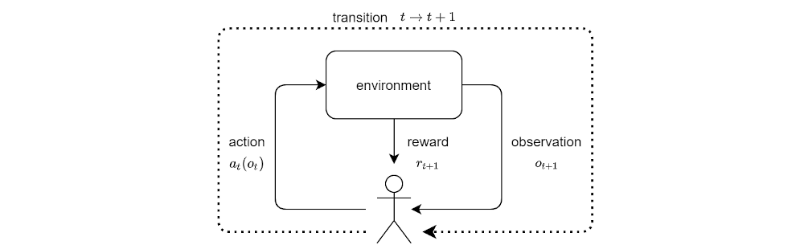
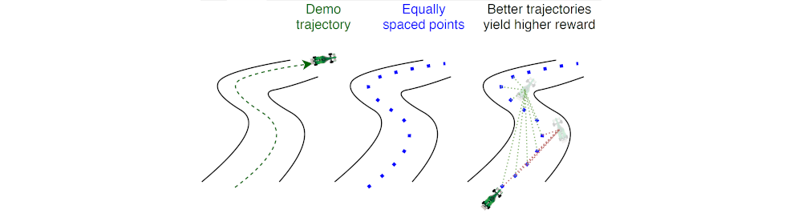
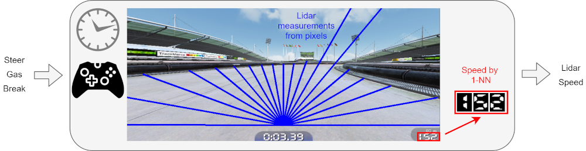
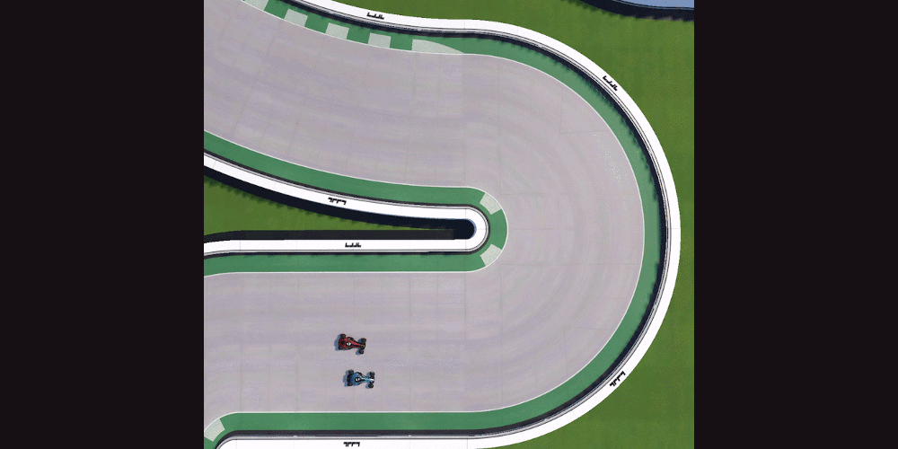
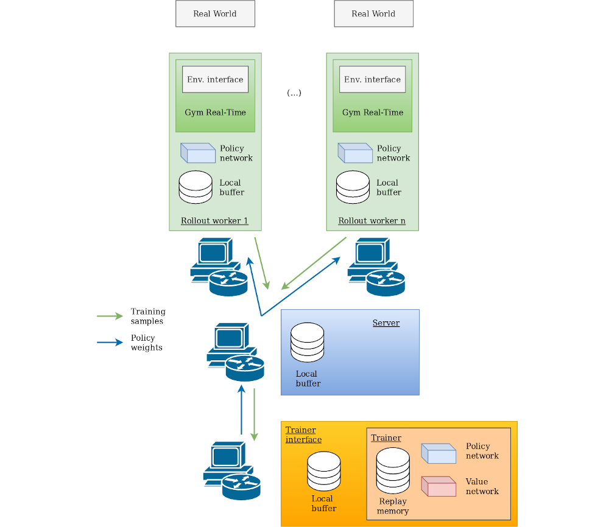

# TMRL

[](https://badge.fury.io/py/tmrl)
[](https://github.com/trackmania-rl/tmrl/blob/master/LICENSE)
[](https://zenodo.org/badge/latestdoi/277973609)
[](https://github.com/trackmania-rl/tmrl/actions/workflows/ci.yml)

| **`API reference`**                                                                                                                         |
|---------------------------------------------------------------------------------------------------------------------------------------------|
| [](https://tmrl.readthedocs.io/en/latest/?badge=latest) |


`tmrl` is a fully-fledged distributed RL framework for robotics, designed to help you train Deep Reinforcement Learning AIs in real-time applications.

`tmrl` comes with an example self-driving pipeline for the TrackMania 2020 video game.

 **TL;DR:**

- :red_car: **AI and TM enthusiasts:**\
`tmrl` enables you to train AIs in TrackMania with minimal effort. Tutorial for you guys [here](readme/get_started.md), video of a pre-trained AI [here](https://www.youtube.com/watch?v=hQkltOX0TYw), and beginner introduction to the SAC algorithm [here](https://www.youtube.com/watch?v=LN29DDlHp1U).

- :rocket: **ML developers / roboticists:**\
`tmrl` is a python library designed to facilitate the implementation of ad-hoc RL pipelines for industrial applications, and most notably real-time control. Full tutorial [here](readme/tuto_library.md) and documentation [here](https://tmrl.readthedocs.io/en/latest/).

- :ok_hand: **ML developers who are TM enthusiasts with no interest in learning this huge thing:**\
`tmrl` provides a Gymnasium environment for TrackMania that is easy to use. Fast-track for you guys [here](#trackmania-gymnasium-environment).

- :earth_americas: **Everyone:**\
`tmrl` hosts the [TrackMania Roborace League](readme/competition.md), a vision-based AI competition where participants design real-time self-racing AIs in the TrackMania 2020 video game.


## Quick links
- [The TMRL Project](#the-tmrl-project)
  - [Introduction](#introduction)
    - [User features](#user-features-trackmania-example-pipeline)
    - [Developer features](#developer-features-real-world-applications-in-python)
    - [TMRL in the media](#tmrl-in-the-media)
  - [Installation](readme/Install.md)
    - [Windows](readme/Install.md)
    - [Linux](readme/install_linux.md)
  - [Getting started](readme/get_started.md)
    - [Quick reference guide](readme/reference_guide.md)
  - [Changelog](CHANGELOG.md)
  - [Contributing](CONTRIBUTING.md)
  - [Makefile (development & track pipeline)](#makefile-development--track-pipeline)
  - [TMRL python library for robot learning](readme/tuto_library.md)
    - [API reference](https://tmrl.readthedocs.io/en/latest/)
  - [Security (important)](#security)
- [TrackMania applications](#autonomous-driving-in-trackmania)
  - [TrackMania Roborace League](readme/competition.md)
  - [TrackMania Gymnasium environment](#trackmania-gymnasium-environment)
    - [LIDAR environment](#lidar-environment)
    - [Full environment](#full-environment)
  - [TrackMania training details](#trackmania-training-details)
    - [RL basics](#reinforcement-learning-basics)
    - [SAC](#soft-actor-critic)
    - [REDQ](#randomized-ensembled-double-q-learning)
    - [A clever reward](#a-clever-reward)
    - [Available action spaces](#available-action-spaces)
    - [Available observation spaces](#available-observation-spaces)
    - [Results](#results)
- [Framework details](#framework-details)
    - [Real-time Gym framework](#real-time-gym-framework)
      - [rtgym repo](https://github.com/yannbouteiller/rtgym)
  - [Remote training architecture](#remote-training-architecture)
- [Contribute](#authors)
- [Sponsors](#sponsors)


# The TMRL project

## Introduction

`tmrl` is a python framework designed to help you train Artificial Intelligences (AIs) through deep Reinforcement Learning (RL) in real-time applications (robots, video-games, high-frequency control...).

As a fun and safe robot proxy for vision-based autonomous driving, `tmrl` features a readily-implemented example pipeline for the TrackMania 2020 racing video game.

_Note: In the context of RL, an AI is called a policy._

### User features (TrackMania example pipeline):

* **Training algorithms:**
`tmrl` comes with a readily implemented example pipeline that lets you easily train policies in TrackMania 2020 with state-of-the-art Deep Reinforcement Learning algorithms such as [Soft Actor-Critic](https://www.youtube.com/watch?v=LN29DDlHp1U) (SAC), [Randomized Ensembled Double Q-Learning](https://arxiv.org/abs/2101.05982) (REDQ), and [Implicit Quantile Networks](https://arxiv.org/abs/1806.06923) (IQN) for discrete action spaces.
These algorithms store collected samples in a large dataset, called a replay memory.
In parallel, these samples are used to train an artificial neural network (policy) that maps observations (images, speed...) to relevant actions (gas, brake, steering angle...).

* **Analog control from screenshots:**
The `tmrl` example pipeline trains policies that are able to drive from raw screenshots captured in real-time.
For beginners, we also provide simpler rangefinder ("LIDAR") observations, which are less potent but easier to learn from.
The example pipeline controls the game via a virtual gamepad, which enables analog actions.

* **Models:**
To process LIDAR measurements, the example `tmrl` pipeline uses a Multi-Layer Perceptron (MLP).
To process raw camera images (snapshots), it uses a Convolutional Neural Network (CNN).
These models learn the physics of the game from histories or observations equally spaced in time.

### Developer features (real-world applications in Python):

* **Python library:**
`tmrl` is a complete framework designed to help you successfully implement ad-hoc RL pipelines for real-world applications. It features secure remote training, fine-grained customizability, and it is fully compatible with [real-time environments](#real-time-gym-framework) (e.g., robots...).
It is based on a [single-server / multiple-clients architecture](#remote-training-architecture), which enables collecting samples locally from one to arbitrarily many workers, and training remotely on a High Performance Computing cluster.
A complete tutorial toward doing this for your specific application is provided [here](readme/tuto_library.md).

* **TrackMania Gymnasium environment:**
`tmrl` comes with a Gymnasium environment for TrackMania 2020, based on [rtgym](https://pypi.org/project/rtgym/). Once the library is installed, it is easy to use this environment in your own training framework. More information [here](#trackmania-gymnasium-environment).

* **External libraries:**
`tmrl` gave birth to some sub-projects of more general interest, that were cut out and packaged as standalone python libraries.
In particular, [rtgym](https://github.com/yannbouteiller/rtgym) enables implementing Gymnasium environments in real-time applications,
[vgamepad](https://github.com/yannbouteiller/vgamepad) enables emulating virtual game controllers,
and [tlspyo](https://github.com/MISTLab/tls-python-object) enables transferring python object over the Internet in a secure fashion.

### TMRL in the media:
- In the french show [Underscore_ (2022-06-08)](https://www.youtube.com/watch?v=c1xq7iJ3f9E), we used a vision-based (LIDAR) policy to play against the TrackMania world champions. Spoiler: our policy lost by far (expectedly :smile:); the superhuman target was set to about 32s on the `tmrl-test` track, while the trained policy had a mean performance of about 45.5s. The Gymnasium environment that we used for the show is available [here](#lidar-with-track-progress).

- In 2023, we were [invited at Ubisoft Montreal](https://youtu.be/Nm71G0-wnFU?feature=shared&t=4317) to give a talk describing how video games could serve as visual simulators for vision-based autonomous driving in the near future.

## Installation

Detailed instructions for installation are provided at [this link](readme/Install.md).

## Getting started

Full guidance toward setting up an environment in TrackMania 2020, testing pre-trained weights, as well as a beginner-friendly tutorial to train, test, and fine-tune your own models, are provided at [this link](readme/get_started.md).

## Configuration system

`tmrl` uses [Hydra](https://hydra.cc/) for hierarchical configuration with [Pydantic](https://docs.pydantic.dev/) validation. Configuration files are in YAML format and organized by component:

- **Defaults**: `tmrl/config/defaults/` - Shipped algorithm, model, and environment presets
- **Presets**: `tmrl/config/presets/` - Complete training configurations (e.g., `optimal-params-tuning-v5.11-stable.yaml`)
- **User overrides**: `~/TmrlData/config/local.yaml` - Your custom settings (not tracked by git)

**Ways to configure:**

1. **Local YAML file** (recommended):
   ```yaml
   # ~/TmrlData/config/local.yaml
   environment:
     rtgym_interface: TM20LIDAR
     map_name: my_custom_map
   algorithm:
     name: SAC
     lr_actor: 0.0001
   ```

2. **Environment variable**:
   ```bash
   export TMRL_HYDRA_OVERRIDES="algorithm.lr_actor=0.0001,environment.map_name=test_track"
   ```

3. **Preset selection**:
   ```bash
   # Uses tmrl/config/presets/my-preset.yaml
   export TMRL_CONFIG_PRESET=my-preset
   ```

See `tmrl/config/README.md` for detailed documentation and `tmrl/config/schema/` for all available options.

For route-level config explainability, use `python -m tmrl --explain-active-config` (or `make explain-config`).
The report is generated by `tmrl/config/active_config_explainer.py` (legacy alias: `effective_config.py`), which mirrors runtime model-routing logic and
prints which `model.*` keys are active (or ignored) for the current `algorithm.name` + `environment.rtgym_interface`.

## Makefile (development & track pipeline)

This repository ships a `Makefile` that picks a [uv](https://github.com/astral-sh/uv) project environment (`.venv-linux`, `.venv-windows`, or `.venv`) and runs commands with `UV_PROJECT_ENVIRONMENT` set accordingly. On native Windows, recipes use PowerShell so Ctrl+C does not stop in the “Terminate batch job” prompt.

**Quick start for a new track:**
1. `make record-track-boundaries` - Record left/right track edges interactively
2. `make build-centerline-reward` or `make record-reward` - Create reward trajectory
3. `make check-env` - Verify setup before training
4. `make trainer` / `make worker` - Start distributed training

### Code quality and tests

The `fmt`, `lint`, and `types` targets call Ruff and Mypy under `.venv/bin/` (see the Makefile). If they fail, create or sync that venv (`uv venv`, `make install-dev`).

| Target | Command |
|--------|---------|
| `make install-dev` | `uv sync --group dev` |
| `make fmt` | Ruff format + auto-fix |
| `make lint` | Ruff check |
| `make types` | Mypy on `tmrl/` |
| `make check` | `lint` + `types` |
| `make test` / `make tests` | Pytest |

### Distributed training

| Target | Notes |
|--------|--------|
| `make server` | Frees `TMRL_SERVER_PORT` (default `55555`) then runs `python -m tmrl --server`. Override with `make server TMRL_SERVER_PORT=...`. |
| `make trainer` | Prints active config, then trainer. |
| `make worker` | Prints active config, then rollout worker. |
| `make record-episode` | Records episodes; optional count: `make record-episode 5`. |

### Track reward, boundaries, and verification

These targets wrap the same Python entrypoints as the CLI/scripts; paths come from your TmrlData / Hydra config unless you pass overrides.

**Typical order for a new map:** record left/right boundaries → build or record a reward trajectory → optionally densify the reward polyline → `check-env` before training.

| Target | What it runs |
|--------|----------------|
| `make record-track-boundaries` | `tmrl/tools/record_track.py` — interactive left/right boundary recording (OpenPlanet telemetry; spline/resampling on lap finish). |
| `make extend-boundaries` | `record_track.py extend` — append straight extensions. Set **`BOUNDARY_PKLS`** to one or more `.pkl` paths (space-separated); use exactly two for parallel left/right extension. Optional **`EXTEND_METERS`** (default `100`). |
| `make build-centerline-reward` | `scripts/build_centerline_reward.py` — centerline reward from boundary pickles. Optional **`CENTERLINE_ARGS`** (e.g. `--debug-plot`, `--base-reward /path/to.pkl`). |
| `make record-reward` | `python -m tmrl --record-reward` — drive a lap to record a reward trajectory to `REWARD_PATH`. |
| `make interpolate-reward` | `scripts/interpolate_reward_trajectory.py` — arc-length upsampling along the reward polyline. Optional **`REWARD_INPUT`** (empty → `tmrl.config.REWARD_PATH`). **`INTERP_FACTOR`** (default `10`). |
| `make plot-boundaries` | `scripts/plotTrackPoints.py` — optional **`PLOT_ARGS`** (e.g. `--html-out tmp/track.html`). |
| `make plot-reward` | `scripts/plotRewardPoints.py` — optional **`PLOT_ARGS`**. |
| `make check-env` | `python -m tmrl --check-env` — verify boundary lidar or full-vision env. |
| `make explain-config` | `python -m tmrl --explain-active-config` — which config fields apply to the current algorithm/interface. |
| `make import-player-runs` | Requires **`PLAYER_RUNS_PATHS`** (comma-separated `.pkl` list); runs `--import-player-runs`. |

**Examples:**

```bash
make record-track-boundaries
make build-centerline-reward CENTERLINE_ARGS='--debug-plot'
make interpolate-reward INTERP_FACTOR=10
make extend-boundaries BOUNDARY_PKLS="track_mymap_left.pkl track_mymap_right.pkl"
make check-env
make import-player-runs PLAYER_RUNS_PATHS="$HOME/TmrlData/player_runs/run1.pkl,$HOME/TmrlData/player_runs/run2.pkl"
```

## TMRL python library

An advanced tutorial toward implementing your own ad-hoc optimized training pipelines for your own real-time tasks is provided [here](readme/tuto_library.md).

## Security

:warning: **IMPORTANT: READ AND UNDERSTAND THIS SECTION BEFORE YOU USE `tmrl` ON A PUBLIC NETWORK.**

Security-wise, `tmrl` is based on [tlspyo](https://github.com/MISTLab/tls-python-object).

By default, `tmrl` transfers objects via non-encrypted TCP in order to work out-of-the-box.
This is fine as long as you use `tmrl` on your own private network.

HOWEVER, THIS IS A SECURITY BREACH IF YOU START USING `tmrl` ON A PUBLIC NETWORK.

To securely use `tmrl` on a public network (for instance, on the Internet), enable Transport Layer Security (TLS).
Configure these settings in your `~/TmrlData/config/local.yaml` (or via environment variables):

```yaml
distributed:
  use_tls: true
  password: "your_strong_password_here"  # Same on all machines
  tls_hostname: "default"
  tls_credentials_directory: ""  # Empty for default location
```

**TLS setup steps:**

1. On the **server machine**, generate a TLS key and certificate (follow the [tlspyo instructions](https://github.com/MISTLab/tls-python-object#tls-setup))
2. Copy the generated certificate to **all worker/trainer machines** (either to the default tlspyo credentials directory or a custom directory)
3. If using a custom directory, set `distributed.tls_credentials_directory` to its path
4. Set the **same password** on all machines (or use `TMRL_PASSWORD` environment variable)

**Without TLS** (not recommended): You should still change the default password when training over a public network.
**DO NOT USE A PASSWORD YOU USE FOR OTHER APPLICATIONS** - without TLS encryption, this password will be readable in network packets and can be intercepted.

# Autonomous driving in TrackMania

## TrackMania Roborace League

We host the [TrackMania Roborace League](readme/competition.md), a fun way of benchmarking self-racing approaches in the TrackMania 2020 video game.
Follow the link for information about the competition, including the current leaderboard and instructions to participate.

Regardless of whether they want to compete or not, ML developers will find the [competition tutorial script](https://github.com/trackmania-rl/tmrl/blob/master/tmrl/tuto/competition/custom_actor_module.py) handy for creating advanced training pipelines in TrackMania.

## TrackMania Gymnasium environment
In case you only wish to use the `tmrl` Real-Time Gym environment for TrackMania in your own training framework, this is made possible by the `get_environment()` method:

_(NB: the game needs to be set up as described in the [getting started](readme/get_started.md) instructions)_

```python
from tmrl import get_environment
from time import sleep
import numpy as np


# Boundary LIDAR observations provide 60-float vectors representing
# pre-recorded left/right track boundaries ahead of the car
# Actions are [gas, brake, steer], analog between -1.0 and +1.0
def model(obs):
  """
  Simplistic policy example - actual observation shape depends on your config.
  For boundary LIDAR: obs includes speed, boundary points, and action history.
  """
  # Simple forward acceleration
  return np.array([1.0, 0.0, 0.0])


# Retrieve the TMRL Gymnasium environment
# The environment depends on your Hydra configuration (see config section below)
env = get_environment()

sleep(1.0)  # time to focus the TM20 window after starting

obs, info = env.reset()  # reset environment
for _ in range(200):  # rtgym ensures this runs at 20Hz by default
    act = model(obs)  # compute action
    obs, rew, terminated, truncated, info = env.step(act)  # step
    if terminated or truncated:
        break
env.unwrapped.wait()  # rtgym-specific method to pause the environment
```

### Configuration

`tmrl` uses [Hydra](https://hydra.cc/) for configuration management with [Pydantic](https://docs.pydantic.dev/) schema validation. Configuration can be customized in several ways:

1. **Create a local config file** at `~/TmrlData/config/local.yaml`
2. **Use environment variable**: `export TMRL_HYDRA_OVERRIDES="environment.rtgym_interface=TM20LIDAR"`
3. **Edit preset files** in `tmrl/config/presets/` or `tmrl/config/defaults/`

See `tmrl/config/README.md` for detailed configuration documentation.

### Vision-based environment (images):
This version uses camera images processed with CNNs, along with speed and other telemetry from OpenPlanet.
Works on any track with any camera configuration.

```yaml
# ~/TmrlData/config/local.yaml
environment:
  rtgym_interface: TQCGRAB_IMAGES  # Vision-based interface
  window_width: 256
  window_height: 128
  img_width: 64
  img_height: 64
  img_grayscale: true
  use_images: true
  img_hist_len: 4  # History of 4 images (set to 1 for RNNs)
  sleep_time_at_reset: 1.5

  rtgym_config:
    time_step_duration: 0.05
    start_obs_capture: 0.04
    time_step_timeout_factor: 1.0
    act_buf_len: 2  # Action history (set to 1 for RNNs)
    ep_max_length: 5000  # Episode truncation

  reward:
    end_of_track_reward: 10.0
    constant_penalty: 0.0
    check_forward: 500
    check_backward: 10
    max_stray: 50.0
    min_seconds_before_failure: 3.5  # Terminate after 3.5s without progress
    crash_penalty: 0.5
```

The vision environment is used in the official [TMRL competition](readme/competition.md).
Note that observations are limited to what human players can perceive (no "cheating" with internal game state).

### Boundary LIDAR environment (default):
This is the default interface using **pre-recorded track boundaries** sampled ahead of the car.
Boundaries are recorded once per track using OpenPlanet telemetry (see `make record-track-boundaries`).
The observation is a 60-float vector (30 left + 30 right boundary points) processed with an MLP.

```yaml
# ~/TmrlData/config/local.yaml (or use defaults)
environment:
  rtgym_interface: TM20LIDAR  # Default: pre-recorded boundary interface
  map_name: "your_map_name"  # Must match recorded boundary files
  window_width: 640
  window_height: 480
  sleep_time_at_reset: 1.5
  use_images: false

  rtgym_config:
    time_step_duration: 0.05
    act_buf_len: 2
    ep_max_length: 5000

  reward:
    min_seconds_before_failure: 3.5
    off_track_seconds_before_failure: 0.5
    crash_penalty: 0.5
    max_stray: 50.0
```

**Recording boundaries:** Use `make record-track-boundaries` to record left/right track edges for a new map.
The boundaries are saved to `~/TmrlData/track/{map_name}_left.pkl` and `{map_name}_right.pkl`.

**Alternative tokens:**
- `TM20TRACKMAP` - Legacy alias for TM20LIDAR
- `TM20TRACKMAPIMAGES` - Boundary + image fusion
- `TM20LIDARIMAGES` - Boundary + image fusion

### Advanced reward shaping

Modern `tmrl` includes sophisticated reward components beyond simple progress tracking:

```yaml
environment:
  reward:
    # Progress rewards
    progress_reward_full_lap: 200.0  # Bonus for completing one lap
    end_of_track_reward: 10.0  # Finish line bonus

    # Speed rewards (encourage fast, aligned driving)
    speed_reward_weight: 0.0  # Scale for speed-based rewards
    speed_reward_exponent: 1.0  # Emphasize high-speed segments
    max_speed_kmh: 300.0  # Normalization reference

    # Drift/cornering rewards (only active when reward_progress > 0 — forward progress required)
    drift_reward_weight: 0.0  # Enable drift shaping
    cornering_speed_bonus: 0.0  # Bonus for fast cornering

    # Penalties and termination
    crash_penalty: 0.5           # Applied on boundary crashes
    terminal_failure_penalty: 0.0  # Applied on non-boundary terminal failures (e.g. timeout)
    constant_penalty: 0.0  # Per-step penalty
    min_seconds_before_failure: 3.5  # Terminate after 3.5s without progress
    off_track_seconds_before_failure: 0.5  # Grace period after reset
    max_stray: 50.0  # Max lateral distance from trajectory (meters)

    # Advanced options
    reward_scale: 1.0  # Global reward multiplier
    reward_clip_floor: 10.0  # Clip large negative rewards
```

See `tmrl/config/schema/environment.py` for all available reward parameters.

## TrackMania training details

In the example `tmrl` pipeline, an AI (policy) that knows absolutely nothing about driving or even about what a road is, is set at the starting point of a track.
Its goal is to learn how to complete the track as fast as possible by exploring its own capabilities and environment.

The car feeds observations such as images to an artificial neural network, which must output the best possible controls from these observations.
This implies that the AI must understand its environment in some way.
To achieve this understanding, it explores the world for a few hours (up to a few days), slowly gaining an understanding of how to act efficiently.
This is accomplished through Deep Reinforcement Learning (RL).

### Reinforcement Learning basics

Most RL algorithms are based on a mathematical description of the environment called Markov Decision Process (MDP).
A policy trained via RL interacts with an MDP as follows:



In this illustration, the policy is represented as the stickman, and time is represented as time-steps of fixed duration.
At each time-step, the policy applies an action (float values for gas, brake, and steering) computed from an observation.
The action is applied to the environment, which yields a new observation at the end of the transition.

For the purpose of training this policy, the environment also provides another signal, called the "reward".
RL is inspired from behaviorism, which relies on the fundamental idea that intelligence is the result of a history of positive and negative stimuli.
The reward received by the AI at each time-step is a measure of how well it performs.

In order to learn how to drive, the AI tries random actions in response to incoming observations, gets rewarded positively or negatively, and optimizes its policy so that its long-term reward is maximized.

### Soft Actor-Critic

([Introductory video](https://www.youtube.com/watch?v=LN29DDlHp1U))

([Full paper](https://arxiv.org/abs/1801.01290))

Soft Actor-Critic (SAC) is an algorithm that enables learning continuous stochastic controllers.

More specifically, SAC does this using two separate Artificial Neural Networks (NNs):

- The first one, called the "policy network" (or, in the literature, the "actor"), is the NN the user is ultimately interested in : the controller of the car.
  It takes observations as input and outputs actions.
- The second called the "value network" (or, in the literature, the "critic"), is used to train the policy network.
  It takes an observation ```x``` and an action ```a``` as input, to output a value.
  This value is an estimate of the expected sum of future rewards if the AI observes ```x```, selects ```a```, and then uses the policy network forever (there is also a discount factor so that this sum is not infinite).

Both networks are trained in parallel using each other.
The reward signal is used to train the value network, and the value network is used to train the policy network.

Advantages of SAC over other existing methods are the following:
- It is able to store transitions in a huge circular buffer called the "replay memory" and reuse these transitions several times during training.
  This is an important property for applications such as TrackMania where only a relatively small number of transitions can be collected due to the Real-Time nature of the setting.
- It is able to output analog controls. We use this property with a virtual gamepad.
- It maximizes the entropy of the learned policy.
  This means that the policy will be as random as possible while maximizing the reward.
  This property helps explore the environment and is known to produce policies that are robust to external perturbations, which is of central importance in real-world self-driving scenarios.

### Randomized Ensembled Double Q-Learning

([Full paper](https://arxiv.org/abs/2101.05982))

REDQ is a more recent methodology that improves the performance of value-based algorithms like SAC.

The improvement introduced by REDQ consists essentially of training an ensemble of parallel value networks from which a subset is randomly sampled to evaluate target values during training.
The authors show that this enables low-bias updates and a sample efficiency comparable to model-based algorithms, at a much lower computational cost.

By default, `tmrl` trains policies with vanilla SAC.
To use REDQ-SAC, set the algorithm in your configuration:

```yaml
# ~/TmrlData/config/local.yaml
algorithm:
  name: REDQSAC
  learn_entropy_coef: false
  lr_actor: 0.0003
  lr_critic: 0.00005
  lr_entropy: 0.0003
  gamma: 0.995
  polyak: 0.995
  target_entropy: -7.0
  alpha: 0.37
  redq_n: 10  # Number of parallel critics
  redq_m: 2  # Subset size
  redq_q_updates_per_policy_update: 20  # Critic updates per actor update
```

Other supported algorithms:
- **SAC** (default): Soft Actor-Critic
- **REDQSAC**: REDQ variant of SAC
- **TQC**: Truncated Quantile Critics
- **IQN**: Implicit Quantile Networks (discrete actions)
- **SDSAC**: Sophy-inspired SAC variant

### Implicit Quantile Network (IQN)

([Full paper](https://arxiv.org/abs/1806.06923))

IQN is a distributional RL algorithm for **discrete action spaces**.
Rather than learning a single expected Q-value per action, IQN learns the full return distribution by sampling implicit quantile levels at training time, which leads to more robust value estimates and better exploration.

IQN uses Double DQN-style action selection (online network selects the action, target network evaluates it) and a quantile Huber loss aggregated over sampled quantile pairs.
It pairs naturally with n-step returns, Munchausen RL, and demo-guided learning via a behavioral cloning loss.

To use IQN, set the algorithm in your configuration:

```yaml
# ~/TmrlData/config/local.yaml
algorithm:
  name: IQN
  iqn_n_steer_bins: 13      # Discrete steering resolution (odd number)
  gamma: 0.99
  n_steps: 3                # N-step returns (requires memory_type: generic)
  n_quantiles: 8            # Quantile samples for training targets
  n_quantiles_eval: 32      # Quantile samples for action selection
  double_dqn: true
  munchausen_enabled: false
  bc_lambda: 0.0            # Demo behavioral cloning weight
  reward_normalize_scale: 1.0
```

**Note:** IQN requires `memory.memory_type: generic` when using `n_steps > 1`, since only the generic memory implements proper n-step return accumulation.

### A clever reward

As mentioned before, a reward function is needed to evaluate how well the policy performs.

There are multiple reward functions that could be used.
For instance, one could directly use the raw speed of the car as a reward.
This makes some sense because the car slows down when it crashes and goes fast when it is performing well.

This approach would be naive, though.
The actual goal of racing is not to move as fast as possible.
Rather, one wants to complete the largest portion of the track in the smallest possible amount of time.
This is not equivalent as one should consider the optimal trajectory, which may imply slowing down on sharp turns in order to take the apex of each curve.

In TrackMania 2020, we use a more advanced and conceptually more interesting reward function:



For a given track, we record one single demonstration trajectory.
This does not have to be a good demonstration, but only to follow the track.
Once the demonstration trajectory is recorded, it is automatically divided into equally spaced points.

During training, at each time-step, the reward is then the number of such points that the car has passed since the previous time-step.
In a nutshell, whereas the previous reward function was measuring how fast the car was, this new reward function measures how good it is at covering a big portion of the track in a given amount of time.

### Available action spaces

In `tmrl`, the car can be controlled in different ways:

- **Analog control** (continuous): The policy controls gas, brake, and steering with continuous values [-1.0, +1.0] via a virtual XBox360 controller using the [vgamepad](https://pypi.org/project/vgamepad/) library (Windows/Linux).
- **Discrete actions**: The policy selects from a discrete set of actions (used with IQN algorithm).

The default is analog control with continuous SAC-based algorithms.

### Available observation spaces

Different observation spaces are available in the TrackMania pipeline:

- **Vision (images)**: History of raw screenshots (typically 4 frames) processed with CNNs
- **Boundary LIDAR**: Pre-recorded track boundaries ahead of the car (60-float vector: 30 left + 30 right points)
- **Hybrid**: Combination of images and boundary observations
- **World telemetry**: Full vehicle state from OpenPlanet (position, velocity, orientation, etc.)

All interfaces include velocity information as part of the observation space.

Example visualization of boundary LIDAR:



In TrackMania 2020, we use the [OpenPlanet](https://openplanet.nl) plugin to retrieve real-time telemetry:
- **Car state**: Position, velocity, orientation, angular velocity, wheel contact
- **Track boundaries**: Pre-recorded during track exploration (saved to `.pkl` files)
- **Race info**: Checkpoint times, lap completion, race state

**Note:** Boundary "LIDAR" observations are **not** computed from screenshots. They are recorded once per track using OpenPlanet telemetry and stored in files. During training, the nearest boundary segments ahead of the car are looked up and transformed to the car's local coordinate frame.

### Results

In the following experiment, on top of the raw speed, the blue car is using a single LIDAR measurement whereas the red car is using a history of 4 LIDAR measurements.
The positions of both cars are captured at constant time intervals in this animation:



The blue car learned to drive at a constant speed, as it is the best it can do from its naive observation space.
Conversely, the red car is able to infer higher-order dynamics from the history of 4 LIDARs and successfully learned to break, take the apex of the curve, and accelerate again after this sharp turn, which is slightly better in this situation.

# Framework details

## Real-time Gym framework:
This project uses [Real-Time Gym](https://github.com/yannbouteiller/rtgym) (```rtgym```), a simple python framework that enables efficient real-time implementations of Delayed Markov Decision Processes in real-world applications.

```rtgym``` constrains the times at which actions are sent and observations are retrieved as follows:


Time-steps are being elastically constrained to their nominal duration. When this elastic constraint cannot be satisfied, the previous time-step times out and the new time-step starts from the current timestamp.

Custom `rtgym` interfaces for Trackmania used by `tmrl` are accessible via the canonical namespace [`tmrl.interfaces`](tmrl/interfaces/__init__.py) (implementations in [`tmrl/custom/interfaces`](tmrl/custom/interfaces)).

## Extending TMRL

TMRL exposes four canonical namespaces that re-export all built-in components without moving files:

| Namespace | Contents |
|---|---|
| `tmrl.algorithms` | SAC, REDQSAC, TQC, IQN, SDSAC training agents |
| `tmrl.models` | MLP, ResidualMLP, CNN, EfficientNet, IMPALA, Sophy, IQN Q-networks, … |
| `tmrl.interfaces` | `TM2020RLInterface`, `TM2020InterfaceBoundary`, … |
| `tmrl.memories` | `MemoryTMBest`, `MemoryTMFull`, `MemoryR2D2`, `GenericTorchMemory`, … |
| `tmrl.trackmania` | `Telemetry`, `WorldTelemetryObsIndex`, observation-space builders, pre-processors |

**Adding a new algorithm, model, interface, or memory** can be done two ways:

*In-repo:* use the `@register` decorator from `tmrl.registry`:
```python
from tmrl.registry import ALGORITHMS

@ALGORITHMS.register("my_algo")
class MyAlgo(TrainingAgent):
    ...
```

*Third-party package (plugin):* declare a Python entry point and TMRL auto-discovers it on `import tmrl`:
```toml
[project.entry-points."tmrl.algorithms"]
my_algo = "mypackage.module:MyAlgo"

[project.entry-points."tmrl.models"]
my_model = "mypackage.models:MyModel"

[project.entry-points."tmrl.memories"]
my_memory = "mypackage.memories:MyMemory"
```

No TMRL source modification needed — install your package and it appears in the registry.
See [CONTRIBUTING.md](CONTRIBUTING.md) for the full workflow.

## Remote training architecture:

`tmrl` is built with [tlspyo](https://github.com/MISTLab/tls-python-object).
Its client-server architecture is similar to [Ray RLlib](https://docs.ray.io/en/latest/rllib.html).
`tmrl` is not meant to compete with Ray, but it is much simpler to adapt in order to implement ad-hoc pipelines, and works on both Windows and Linux.

`tmrl` collects training samples from several rollout workers (typically several computers and/or robots).
Each rollout worker stores its collected samples in a local buffer, and periodically sends this replay buffer to the central server.
Periodically, each rollout worker also receives new policy weights from the central server and updates its policy network.

The central server is located either on the localhost of one of the rollout worker computers, on another computer on the local network, or on another computer on the Internet.
It collects samples from all the connected rollout workers and stores these in a local buffer.
This buffer is then sent to the trainer interface.
The central server receives updated policy weights from the trainer interface and broadcasts these to all connected rollout workers.

The trainer interface is typically located on a non-rollout worker computer of the local network, or on another machine on the Internet (e.g., a GPU cluster).
Of course, it is also possible to locate everything on localhost when needed.
The trainer interface periodically receives the samples gathered by the central server and appends these to a replay memory.
Periodically, it sends the new policy weights to the central server.

These mechanics are summarized as follows:




# Development roadmap:
Contributions to `tmrl` are welcome.
Please consider the following:
- Further profiling and code optimization,
- Find the cleanest way to support sequences in `Memory` for RNN training.

You can discuss contribution projects in the [discussions section](https://github.com/trackmania-rl/tmrl/discussions).


# Authors:

When contributing, please submit a PR with your name in the contributors list with a short caption.

## Maintainers:
- Yann Bouteiller
- Edouard Geze

## Contributors:
- Simon Ramstedt - initial code base
- AndrejGobeX - optimization of screen capture
- Pius - Linux support
- Jakub Szulc - codebase refactoring and modernization

# License

MIT, Bouteiller and Geze, 2021-2026.

# Sponsors:

Many thanks to our sponsors for their support!


[MISTlab - Polytechnique Montreal](https://mistlab.ca)
