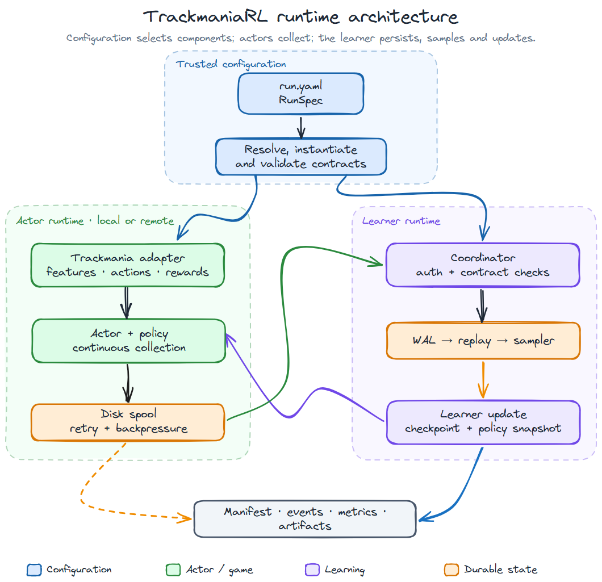
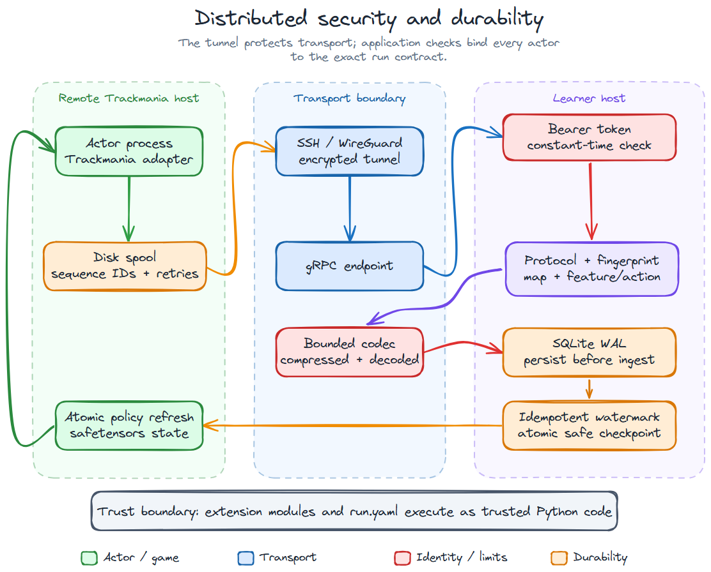
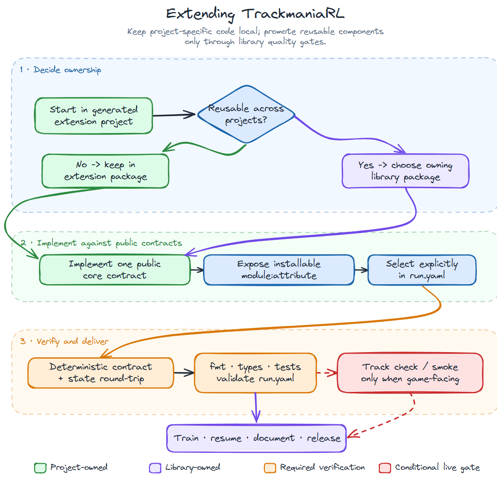

# TrackmaniaRL

[](https://pypi.org/project/TrackmaniaRL/)
[](https://pypi.org/project/TrackmaniaRL/)
[](https://github.com/Palamabron/AITrackmania/actions/workflows/ci.yml)
[](https://github.com/Palamabron/AITrackmania/blob/main/LICENSE)
[](https://pypi.org/project/TrackmaniaRL/)

TrackmaniaRL is a reinforcement-learning library for training agents in
Trackmania 2020. It combines ready-to-use algorithms, replay buffers, model
families and Trackmania telemetry with explicit interfaces for replacing any
component in an experiment.

The current release is available on
[PyPI](https://pypi.org/project/TrackmaniaRL/). TrackmaniaRL requires Python
3.12 or newer.

## What you get

- asynchronous local or distributed actor/learner training;
- SAC, REDQ-SAC, TQC, IQN and stable discrete SAC learners;
- uniform, prioritized, sequence and demonstration-mixing replay;
- typed configuration, transitions and training batches;
- Trackmania telemetry, lidar and track-geometry feature pipelines;
- durable rollout journals, safe policy transfer and resumable checkpoints;
- local JSONL observability with optional W&B, Captum, Gemini and Optuna
  integrations;
- an installable extension project generated by `trackmaniarl init`.

TrackmaniaRL has no global runtime configuration and no mandatory external
tracker. A run is described by `run.yaml` and explicit `module:attribute`
component paths.

## Documentation

| If you want to... | Start here |
| --- | --- |
| install the released library and create an agent | [Quick start](#install-and-create-an-agent) |
| run this repository from source | [Development setup](https://github.com/Palamabron/AITrackmania/blob/main/readme/development.md#repository-setup) |
| understand processes, data flow, security boundaries and package ownership | [Architecture and editable diagrams](https://github.com/Palamabron/AITrackmania/blob/main/readme/architecture.md) |
| replace a learner, model, replay strategy or game adapter | [SDK and extension guide](https://github.com/Palamabron/AITrackmania/blob/main/readme/sdk.md) |
| prepare Trackmania and OpenPlanet | [Trackmania workflow](https://github.com/Palamabron/AITrackmania/blob/main/readme/trackmania.md) |
| report or assess a security issue | [Security policy](https://github.com/Palamabron/AITrackmania/blob/main/SECURITY.md) and [audit](https://github.com/Palamabron/AITrackmania/blob/main/docs/security-audit.md) |

## Install and create an agent

Install the published CLI with [uv](https://docs.astral.sh/uv/):

```bash
uv tool install trackmaniarl
trackmaniarl init my-trackmania-agent --template trackmania
cd my-trackmania-agent
uv sync
uv run trackmaniarl validate run.yaml
```

The `trackmania` template creates a commented, installable agent project with
the Trackmania, algorithm, distributed and W&B extras declared for you. Omit
`--template trackmania` to generate the smaller, game-free starter project.
`trackmaniarl validate` checks imports, contracts and a synthetic learner update
without starting the game or contacting an external tracker.

The generated directory is the application layer of your project. Keep custom
models, rewards and adapters there and treat the installed `trackmaniarl`
package as the reusable library. `run.yaml` is executable configuration because
its `class_path` entries import Python objects; only run configurations and
extension packages you trust.

To add the SDK to an existing Python project instead, choose only the extras you
need:

```bash
uv add trackmaniarl
uv add "trackmaniarl[algorithms,distributed]"
```

| Extra | Adds |
| --- | --- |
| `algorithms` | TorchRL-based algorithm dependencies |
| `trackmania` | Trackmania environment and Windows/Linux virtual-gamepad support |
| `distributed` | authenticated gRPC rollouts, safetensors and compression |
| `wandb` | Weights & Biases logging |
| `explain` | Captum attribution helpers |
| `orchestrator` | Gemini and Optuna experiment strategies |
| `vision` | torchvision support |
| `mamba` | experimental Mamba sequence layers for a Linux CUDA learner |

## Run Trackmania

Live collection requires Trackmania 2020 on Windows, the bundled OpenPlanet
plugin and a prepared map/geometry asset. Follow the
[Trackmania workflow](https://github.com/Palamabron/AITrackmania/blob/main/readme/trackmania.md)
or the concrete
[OpenPlanet guide](https://github.com/Palamabron/AITrackmania/blob/main/trackmaniarl/project/openplanet/README.md)
before starting the game integration.

The generated Trackmania project pins the patched
[Palamabron/vgamepad](https://github.com/Palamabron/vgamepad/tree/5f3435df3f8a0e658feb58b207d9137cdb5183cd)
revision containing the unreleased Windows installation fix from
[vgamepad PR #47](https://github.com/yannbouteiller/vgamepad/pull/47). Keep
that source pin until the fix is included in an upstream vgamepad release.

With Trackmania and the OpenPlanet plugin running:

```bash
uv run trackmaniarl track check
uv run trackmaniarl smoke run.yaml --transitions 100
uv run trackmaniarl train run.yaml
```

The bounded smoke test uses the same asynchronous learner/actor path as
training, verifies a live policy refresh and writes a checkpoint. Start a fresh
run directory when the run API or immutable configuration changes; the current
schema is RunSpec `1.2`.

On Windows, a generated project selects the tested CUDA PyTorch wheels. Linux
uses CPU wheels by default and can host an offline or remote learner. ROCm users
must select the matching AMD Torch index; macOS uses the normal PyPI wheel and
can use MPS. `device: auto` resolves CUDA, ROCm, MPS or CPU from the installed
Torch build.

## Runtime model

<p align="center">
  
</p>

The [architecture guide](https://github.com/Palamabron/AITrackmania/blob/main/readme/architecture.md)
contains the full explanation and editable Excalidraw sources for the runtime,
extension workflow and distributed security model.

`trackmaniarl train` starts a coordinator/learner and one local actor as
independent, Windows-safe `spawn` processes. Collection continues while the
learner updates replay and periodically publishes policy snapshots.

Read the diagram from top to bottom: `run.yaml` selects and validates
components, the actor collects game transitions and spools them durably, and
the learner ingests, samples, updates and checkpoints. The feedback arrow is
an immutable policy snapshot, so an actor never receives a pickled learner
object. Mamba belongs inside the selected model as an opt-in temporal encoder;
it does not change the actor/learner boundary or the rollout protocol.

### Distributed security and durability

For multiple machines, set the same `TRACKMANIARL_DISTRIBUTED_TOKEN` on every
participant and expose the learner through an encrypted tunnel. The learner
binds to loopback so its bearer token and rollout data are not sent over the
network in clear text:

```bash
# Generate once, then put the value in an ignored .env on both machines.
python -c "import secrets; print(secrets.token_urlsafe(32))"

# training machine
uv run trackmaniarl learner run.yaml --bind 127.0.0.1:8787

# Trackmania machine: create the tunnel first
ssh -N -L 8787:127.0.0.1:8787 TRAINING_MACHINE
uv run trackmaniarl actor run.yaml --connect 127.0.0.1:8787 --actor-id PC-1
```

The handshake rejects mismatched run fingerprints, map UIDs, geometry hashes
and feature/action contracts. Rollouts use Protobuf/gRPC with Zstandard
compression, and policy state is transferred with safetensors rather than
pickle.

The token authenticates participants but does not encrypt traffic. Never expose
the gRPC port directly; keep the listener on loopback and use SSH, WireGuard or
another authenticated encrypted tunnel.

<p align="center">
  
</p>

Read this diagram from left to right. An actor persists a rollout before it is
sent, the encrypted tunnel terminates at the learner's loopback listener, and
the learner checks identity, run compatibility and payload limits before WAL
ingestion. The lower control path carries refreshed policy state back to the
actor. The [editable source](https://github.com/Palamabron/AITrackmania/blob/main/docs/diagrams/distributed-security.excalidraw)
is available for architecture reviews.

## Components and extension API

`trackmaniarl.builtins` is the supported catalogue of bundled algorithms,
models, feature pipelines and replay strategies. A component can also be
referenced directly, for example:

```yaml
components:
  learner:
    class_path: trackmaniarl.algorithms.implicit_quantile_q_learning:ImplicitQuantileQLearning
```

### Extension workflow

<p align="center">
  
</p>

Start a new component in the generated extension project. Keep it there when
it is project-specific; move it to the owning library package only when it is
reusable and has passed deterministic contract, configuration and, where
applicable, live Trackmania checks. The [editable workflow diagram](https://github.com/Palamabron/AITrackmania/blob/main/docs/diagrams/extension-workflow.excalidraw)
shows the required gates before training and release.

Read the workflow from left to right: first decide whether the component stays
project-owned or has a reusable library owner, then implement one public core
contract and expose it through an installable `module:attribute`, and finally
run deterministic state, formatting, type, test and configuration gates. The
Trackmania check and bounded smoke test apply only to game-facing components.

The stable contracts in `trackmaniarl.core` include `Learner`, `Policy`,
`ModelFactory`, `ReplayStore`, `Sampler`, `FeaturePipeline`, `Evaluator`,
`RunLogger` and `CheckpointCodec`. Game-specific implementations belong in the
generated extension project, so offline validation does not require Trackmania
or optional game dependencies.

Every run writes a redacted immutable manifest, local JSONL events, checkpoints
and bounded compressed episode artifacts. Only the learner needs W&B
credentials; `WANDB_API_KEY` can be supplied through the environment or project
`.env`.

See the [SDK guide](https://github.com/Palamabron/AITrackmania/blob/main/readme/sdk.md)
for the full component schema and a built-in run example. Release history is in
the [changelog](https://github.com/Palamabron/AITrackmania/blob/main/CHANGELOG.md).

## Development

Clone the repository and install the development group:

```bash
git clone https://github.com/Palamabron/AITrackmania.git
cd AITrackmania
uv sync --group dev
uv run poe fmt
uv run poe types
uv run poe test
```

The commands are intentionally identical on Windows, Linux, WSL and CI. See
[CONTRIBUTING.md](https://github.com/Palamabron/AITrackmania/blob/main/CONTRIBUTING.md)
and [SECURITY.md](https://github.com/Palamabron/AITrackmania/blob/main/SECURITY.md)
before opening a contribution or reporting a vulnerability.

For the repository layout, change workflow, test levels and rules for adding a
public component, read the
[development guide](https://github.com/Palamabron/AITrackmania/blob/main/readme/development.md).

## Project status and attribution

TrackmaniaRL is beta software. The project originated from TMRL and has since
been substantially redesigned. It is not affiliated with or endorsed by
Ubisoft, Nadeo or the TMRL maintainers. Trackmania is a trademark of
Nadeo/Ubisoft. See [NOTICE](https://github.com/Palamabron/AITrackmania/blob/main/NOTICE)
for attribution.
