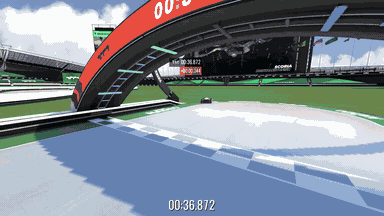

# TrackmaniaRL

TrackmaniaRL is a Python library for training reinforcement-learning agents on
custom Trackmania 2020 maps. It covers map geometry, demonstrations, asynchronous
training, checkpoint resume, and repeatable evaluation.

The game integration runs on Windows. Training and analysis can also run on Linux.
Version 1.2.0 requires Python 3.12 and uses RunSpec 2.0 and checkpoint schema 2.0.

## Installation

Install [uv](https://docs.astral.sh/uv/), then create a project:

```powershell
uv tool install "trackmaniarl==1.2.0"
trackmaniarl init my-agent --template trackmania
cd my-agent
uv sync
```

Until 1.2.0 is published, install a built wheel instead:

```powershell
uv tool install path\to\trackmaniarl-1.2.0-py3-none-any.whl
```

To work from this repository, run `uv sync --group dev` and prefix commands with
`uv run`.

For a game-free installation check, generate the small SDK starter instead:

```powershell
trackmaniarl init sdk-check --template starter
cd sdk-check
uv sync
uv run trackmaniarl inspect-config run.yaml
uv run trackmaniarl validate run.yaml
```

Validation executes trusted component code and a synthetic update. It does not
drive the game or establish driving performance. CPU execution is sufficient for
this check; live neural inference and training benefit from an NVIDIA GPU with
a compatible PyTorch build. See [platform and performance guidance](readme/performance.md).

## Neural inference in motion


This excerpt visualizes the **best-performing model supplied for this release**.
The panel follows geometry, car and context inputs through model stages to action
values and selected controls. The animated summaries are not a causal attribution
of individual neurons. This selected lap uses the map-specific `neighbors` action
filter; it is neither an unassisted-policy benchmark nor evidence of generalization.
See [the model and recording explanation](docs/activation-film.md) for provenance,
the five-attempt film series and [GIF reproduction](docs/neural-flow-media.md).

## Game setup

You need:

- Trackmania 2020 on Windows
- Openplanet in School Mode
- the **TrackmaniaRL Connect / SAC_GetData** plugin
- your map open in the editor's validation mode, with the car at the start.

The plugin uses TCP ports 9000 (telemetry) and 9001 (session and map status) on
localhost. The setup guide explains plugin installation and controller setup:
[Trackmania setup](readme/trackmania.md).

Check the connection before recording data or training:

```powershell
uv run trackmaniarl track check
```

## Configure a map

Record both track boundaries from start to finish, then build the geometry file:

```powershell
uv run trackmaniarl track record-boundary left assets/my-map-left.npy
uv run trackmaniarl track record-boundary right assets/my-map-right.npy
uv run trackmaniarl track build-geometry assets/my-map.geometry.npz `
  --left assets/my-map-left.npy `
  --right assets/my-map-right.npy `
  --map-uid YOUR_MAP_UID `
  --map-path maps/my-map.Map.Gbx
```

Copy the map to `maps/`, then replace `REPLACE_WITH_YOUR_MAP_UID` in `run.yaml`
with the UID printed by `track check`. See [examples/own-map.yaml](examples/own-map.yaml)
for a complete configuration. TrackmaniaRL verifies the open map but does not
select it for you.

## Train and resume

Validate the configuration and run a short smoke test before a full training run:

```powershell
uv run trackmaniarl validate run.yaml
uv run trackmaniarl track check --config run.yaml
uv run trackmaniarl smoke run.yaml --transitions 100
uv run trackmaniarl train run.yaml
```

The starter project uses a lidar encoder, a dueling IQN policy, and 78 discrete
control actions. An actor drives while the learner trains from replay.

Demonstrations are optional:

```powershell
uv run trackmaniarl track record-demo demonstrations --config run.yaml --count 5
uv run trackmaniarl train run.yaml --demo demonstrations
```

Resume the full training state from a checkpoint:

```powershell
uv run trackmaniarl resume run.yaml artifacts/RUN/checkpoints/CHECKPOINT.pt
```

To start a new run with compatible weights, use
`train --model-initialization-checkpoint CHECKPOINT.pt`. A policy-only checkpoint
does not contain optimizer or replay state and cannot be used for an exact resume.

## Evaluate a checkpoint

Run every trial and keep the complete result:

```powershell
uv run trackmaniarl benchmark run.yaml artifacts/RUN/checkpoints/CHECKPOINT.pt `
  --trials 30 --min-finish-rate 1
```

Add `--record recordings/benchmark.mkv` to record the Trackmania window. Recording
requires FFmpeg. Use `--ffmpeg PATH` or `--window-title TITLE` when the defaults do
not match your system.

Each benchmark writes `evaluation.json` and an append-only trial timeline. A DNF
still counts as an attempt. Mean and median times cover finished attempts, so report
them together with the finish rate. Telemetry drops are recorded because they can
delay observations and control decisions. `--reject-telemetry-skips` rejects the
whole evaluation. It never removes individual slow attempts.

More detail: [evaluation architecture](docs/library-architecture.md#checkpoints-and-evaluation),
[recording](docs/recording.md), and [troubleshooting](docs/troubleshooting.md).

## Recorded result on the TMRL test track

| Setup | Finishes | Mean | Median | Best | Worst |
| --- | ---: | ---: | ---: | ---: | ---: |
| V107I checkpoint | 10/10 | 38.061 s | not reported | 36.630 s | 42.430 s |
| V107I + `neighbors` action filter | 30/30 | 36.976667 s | 36.835 s | 36.560 s | 41.370 s |

`neighbors` is not a trained model. It is a wrapper written specifically for the
TMRL test track. Between 54% and 90% track progress, it finds the 15 closest states
in replay recorded on that map. It keeps only actions that occurred in those
states, then lets the unchanged V107I network choose the highest-valued remaining
action. Outside that section, when no close replay state exists, or at very low
speed, the base policy acts without this filter.

This result therefore measures V107I plus map knowledge stored in its replay. It
does not show the performance of the checkpoint alone and says nothing about a new
map. The two table rows also use different trial counts. All 30 confirmation trials
were included. The run reported 458 dropped telemetry frames, so it was not a
zero-drop benchmark.

[Full method and all 30 times](docs/benchmarks/2026-09-08-v108-live.md) ·
[Experiment source](experiments/sub37/README.md)



The image is trial 29 from the full benchmark. Telemetry reports 36.560 s and the
in-game overlay displays 36.568 s.

## Documentation

- [Configuration](readme/configuration.md)
- [Model, observations, actions, and evaluation](docs/library-architecture.md)
- [Neural activation film and repeatable export](docs/activation-film.md)
- [Reward function](docs/reward-function.md)
- [Demonstrations and recovery](readme/imitation-learning.md)
- [Replay and sequences](readme/replay-and-sequences.md)
- [Distributed runtime](readme/architecture.md)
- [Supported and experimental features](docs/support-status.md)
- [Troubleshooting](docs/troubleshooting.md)
- [Migration to schema 2.0](readme/migration-2.0.md)
- [Python API](readme/sdk.md)

PPO and the graph-based recovery models are experimental and are not part of the
default Trackmania training path. The project does not currently provide a camera
vision pipeline. Configuration files and PyTorch checkpoints can execute Python.
only use files you trust.

## Development

```powershell
uv sync --group dev
uv run ruff format --check .
uv run ruff check .
uv run mypy --strict trackmaniarl
uv run pytest
uv build
uv run python scripts/check_distribution.py
```

TrackmaniaRL is released under the [MIT license](LICENSE). It originated from TMRL.
attribution is in [NOTICE](NOTICE). It is not affiliated with Ubisoft or Nadeo.
