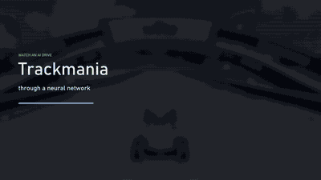

# Neural-flow release media



This visualizes the **best-performing model supplied for this release**, as
identified by the contributor. It does not establish a new ranking of models.
The supplied film is a selected demonstration with a map-specific action filter.
Its five-attempt collection and tensor verification are described in
[Neural network in action](activation-film.md). The historical 30-attempt
benchmark is a separate experiment.

The visible branches summarize road geometry, car features and context, followed
by residual blocks, an IQN action-value head and chosen steering/pedals. Colours
and links summarize recorded activations. Links are not individual synapses or
proof of causality. Geometry is supplied for the map, not inferred from the
gameplay pixels. The [static model diagram](../readme/architecture.md#composed-value-model)
explains the supported compositional API. The film depicts an opt-in graph model,
not the default starter architecture.

## Reproduce the GIF

Source supplied locally: `%USERPROFILE%/Downloads/trackmaniarl-neural-flow-polished-compressed.mp4`.
Use the account-relative form to avoid publishing the contributor's local account
path. Do not add the MP4 or its local sidecars to the source archive.

The source is 1920 × 1080, H.264, 30 fps, 42.10 seconds, with no audio stream.
Source SHA-256:
`aea2e9f65458a48a6aea126971e09f5f983b1fa00c63e1a128475dd1fb98b03c`.
Version 1.2.4 shows the **entire supplied film**, from the start through the finish
and the result card, replacing the short excerpt. No seek, trim or speed changes
are applied. GIF frame durations alternate between 120 and 130 ms because GIF
timing has 10 ms resolution: 337 frames, 42.13 seconds, nominal 8 fps.
Output: **640 × 360, 12,394,864 bytes**, infinite loop.
The 96-colour palette and reduced spatial/frame resolution keep the complete
recording below the distribution's 16 MiB per-file limit. Playback runs at its
original pace, not fast-forward. The MP4 is unchanged.

Exact conversion command (PowerShell. FFmpeg 7.1 from imageio-ffmpeg 0.6.0 on
the review host):

```powershell
$Source = Join-Path $env:USERPROFILE 'Downloads/trackmaniarl-neural-flow-polished-compressed.mp4'
ffmpeg -v error -n -i "$Source" -an -map_metadata -1 -filter_complex "fps=8,scale=640:-1:flags=lanczos,split[a][b];[a]palettegen=stats_mode=diff:max_colors=96[p];[b][p]paletteuse=dither=bayer:bayer_scale=3:diff_mode=rectangle" -loop 0 docs/assets/trackmaniarl-neural-flow.gif
```

Use the path to an installed FFmpeg executable in place of `ffmpeg` if needed.
`-n` refuses to overwrite an existing export. The source is never changed.
Palette generation and application share the same decoded film. Bayer
dithering and rectangle differencing limit animation noise and file size.

## Privacy and accessibility

Metadata inspection found codec/container identifiers, with no location,
account, comment or title metadata. Sampled source frames across the film and
the full-length export showed gameplay, clocks and model/control displays. No
private messages, credentials or account names were observed. This is a visual
review, not a guarantee against every possible identifier in every pixel.
The published GIF has no comment or EXIF/XMP metadata. Only playback metadata
and the looping extension remain. Text alternatives and the static diagram
provide the explanation without requiring the animation to be played.

The existing `rollout-v107c-clean.gif` was also recompressed in full from
29,340,096 to 8,376,597 bytes, keeping its 320 × 176 dimensions and approximately
37.36-second playback. The original remains in the ignored local review evidence
directory. The conversion used the same palette/dither settings, `fps=8`, no
scaling, no seek/trim and `-map_metadata -1`. This is illustrative gameplay,
not the neural-flow source or a new benchmark.
