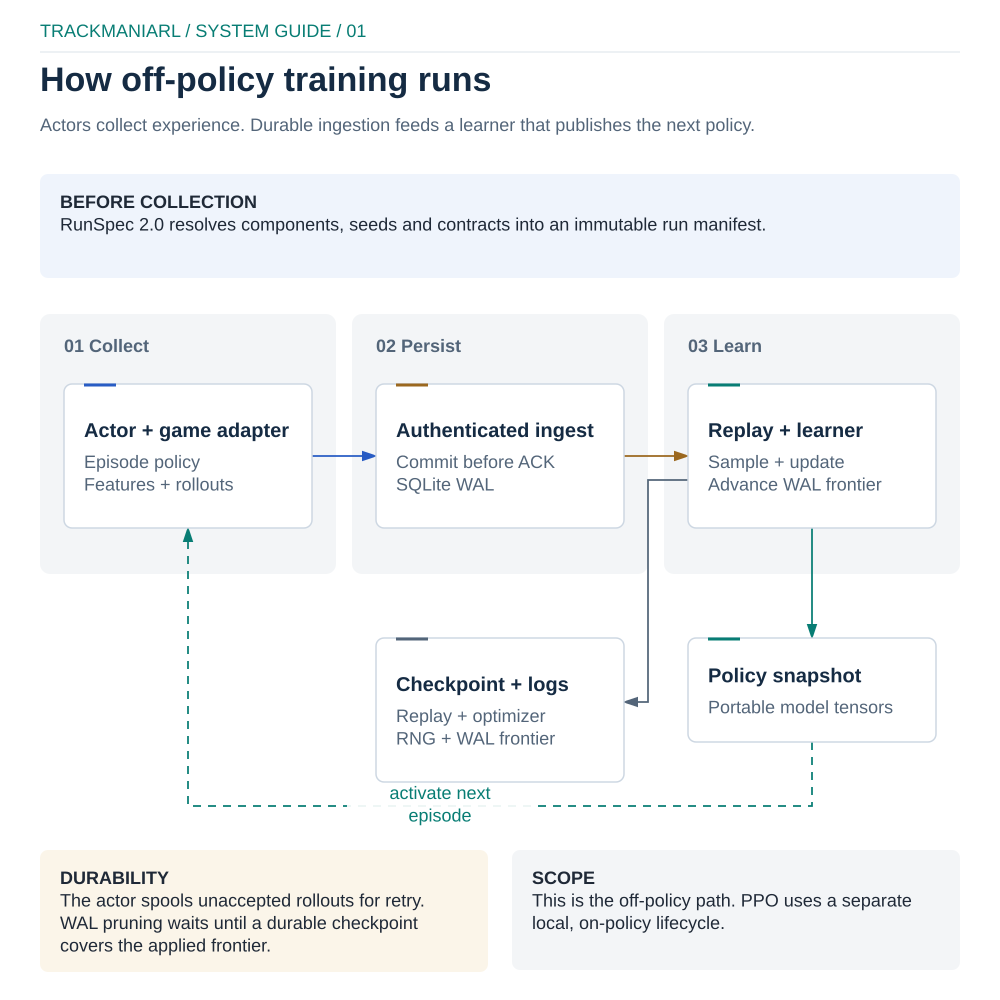
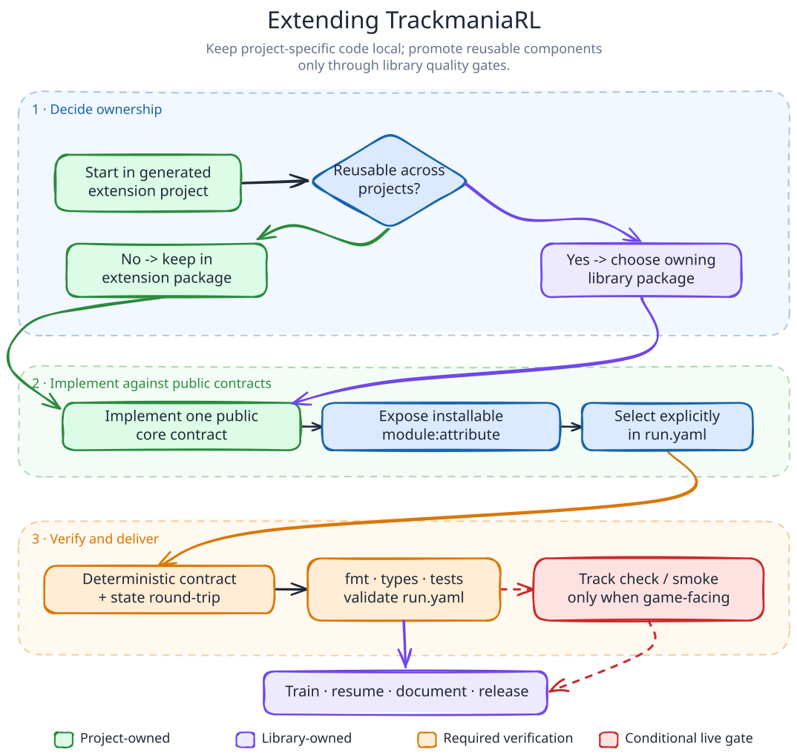
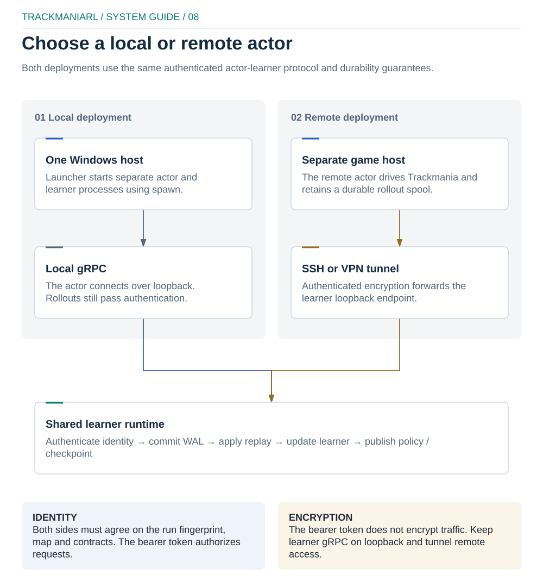

# TrackmaniaRL architecture

This document describes ownership and runtime boundaries for RunSpec `1.2`.
The central rule is that configuration selects components, the core coordinates
them, and game-specific code stays outside the core.

## Runtime data flow

  

[Open the editable Excalidraw source](../docs/diagrams/runtime-architecture.excalidraw)
or the [local interactive preview](../docs/diagrams/runtime-architecture-preview.html).

`trackmaniarl train` starts one coordinator/learner and one local actor with the
portable multiprocessing `spawn` method. Remote mode runs the same two roles as
`trackmaniarl learner` and `trackmaniarl actor` through an encrypted tunnel.
Actors collect continuously; the learner owns replay, optimization, evaluation
and checkpoints. Every completed update can publish a new immutable policy
snapshot back to the actors. The diagram shows this feedback cycle explicitly
alongside the durable rollout path.

## Package ownership

| Package | Owns | Must not own |
| --- | --- | --- |
| `trackmaniarl.core` | contracts, RunSpec, transition/batch data, replay and runtime | Trackmania APIs, remote trackers |
| `trackmaniarl.algorithms` | optimizer and learner implementations | game I/O |
| `trackmaniarl.models` | reusable actors, critics, encoders and backbones | run orchestration |
| `trackmaniarl.builtins` | supported catalogue and stable component entry points | user experiments |
| `trackmaniarl.distributed` | authenticated protocol, codec, coordinator, WAL and actor spool | algorithm policy |
| `trackmaniarl.trackmania` | OpenPlanet telemetry, controls, features, rewards and evaluation | generic runtime contracts |
| `trackmaniarl.observability` | manifests, local events, artifacts and optional tracker adapters | training decisions |
| `trackmaniarl.experiments` | suites, ledgers and study strategies | core configuration |
| `trackmaniarl.project` | generated extension-project files | live run state |

The supported dependency direction is from adapters and implementations toward
`core`. `core` must remain importable without Trackmania, gRPC, W&B or other
optional integrations.

## Configuration and component lifecycle

`RunSpec.from_yaml` parses YAML with `safe_load` and rejects unknown schema
fields. Each `ComponentSpec` names an installed `module:attribute` and keyword
arguments. Resolution imports and instantiates those objects, injects supported
runtime values such as the seed and base directory, and checks the appropriate
runtime protocol.

This is deliberate dependency injection, not a sandbox. Importing a component
can execute its module-level Python code. Treat configuration and extension
packages as trusted code.

The lifecycle is:

1. parse and validate `run.yaml`;
2. resolve paths and instantiate components;
3. verify component contracts;
4. seed random number generators and write the immutable manifest;
5. collect transitions, append to replay and perform updates;
6. publish policy state and write checkpoints/artifacts;
7. close loggers, processes, sockets and game controls.

## Extension workflow

  

[Open the editable Excalidraw source](../docs/diagrams/extension-workflow.excalidraw)
or the [local interactive preview](../docs/diagrams/extension-workflow-preview.html).

Application-specific components should stay in the generated extension project.
Reusable components move into the owning library package only after their
offline contract, state round trip and relevant live gate pass.

Experimental model blocks follow the same ownership boundary. The 1.0.3 Mamba
path keeps frame encoding in `trackmaniarl.models`, exposes the
Trackmania-specific Mamba factory in `trackmaniarl.trackmania`, and remains an
explicit RunSpec choice. See the [Trackmania workflow](trackmania.md#experimental-mamba)
for its sequence and platform contract.

## Data and persistence contracts

`Transition`, `BatchRequest`, `TrainingBatch` and priority updates are typed
dataclasses/PyTrees in hot paths. Replay storage and sampling are separate:
stores own transitions, while samplers own selection, sequence rules, demo
mixing and priority updates.

The distributed path persists accepted rollout chunks in a SQLite WAL before
ingestion and gives each actor a disk spool. Sequence IDs make retries
idempotent. Policy snapshots use safetensors-compatible tensor trees; wire data
has compressed and decompressed size limits. Learner checkpoints use atomic
replacement and PyTorch's restricted `weights_only` loader.

  

[Open the editable Excalidraw source](../docs/diagrams/distributed-security.excalidraw)
or the [local interactive preview](../docs/diagrams/distributed-security-preview.html).

## Compatibility rules

- `api_version` changes only when the serialized run contract changes.
- Public extension contracts live in `trackmaniarl.core.contracts`.
- New experimental components are opt-in and must not silently change defaults.
- A distributed participant must match protocol version, run fingerprint, map
  UID, geometry hash and feature/action contracts.
- A checkpoint resume must preserve optimizer, replay, RNG and algorithm state
  required for equivalent continuation.

See [SDK guide](sdk.md) to implement a component and
[development guide](development.md) to validate a change.
