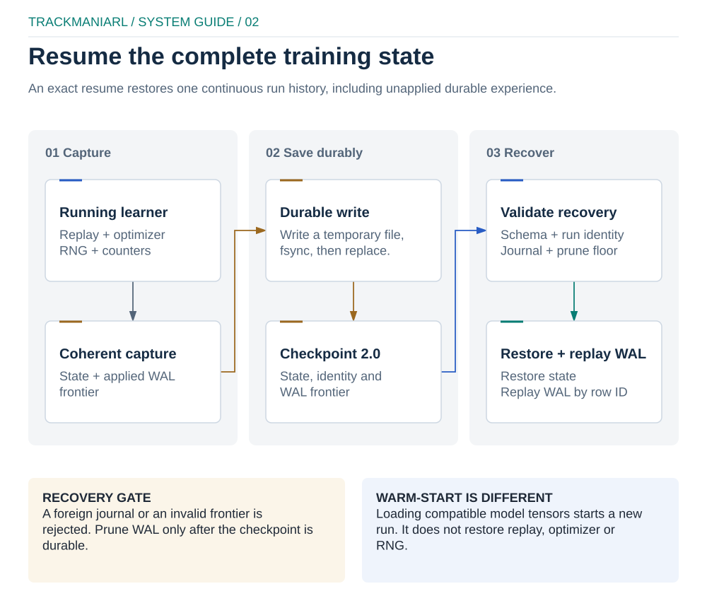
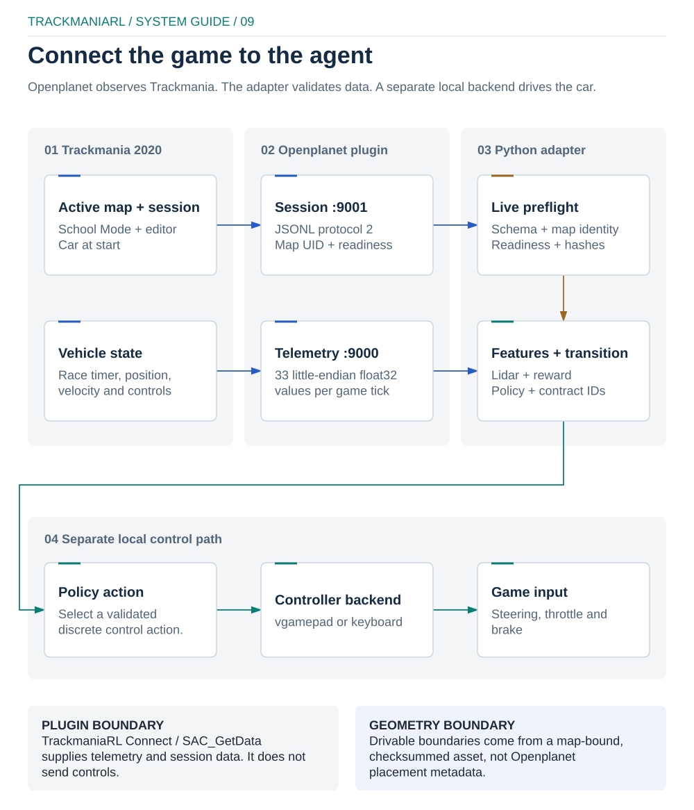

# RunSpec 2.0 architecture

RunSpec `2.0` selects explicit components. The core coordinates them, reusable
learning mechanisms remain game-independent, and Trackmania-specific telemetry,
geometry and controls stay in `trackmaniarl.trackmania`.

## Off-policy runtime data flow

<p align="center">
  
</p>

[Editable source](../docs/diagrams/runtime-architecture.excalidraw) ·
[local preview](../docs/diagrams/runtime-architecture-preview.html)

For off-policy learners, `trackmaniarl train` starts a coordinator/learner and
one local actor with the portable multiprocessing `spawn` method. Remote mode
runs the same roles as `trackmaniarl learner` and `trackmaniarl actor` through
an encrypted tunnel. Actors collect continuously and spool rollouts durably.
The learner authenticates chunks, commits them to WAL, ingests replay, samples
batches, updates the model and publishes immutable policy tensor snapshots.
Accepted rows are applied strictly by SQLite row ID. A checkpoint captures only
the contiguous applied frontier; pruning happens after its durable write, so a
later accepted row can never cause an earlier delayed row to disappear.

PPO follows a separate, single-process on-policy lifecycle through
`trackmaniarl.Trainer` and `OnPolicySequenceSampler`; it does not use the
distributed WAL/replay protocol shown here.

The actor–learner protocol, replay records and WAL format are algorithm-neutral.
Changing scalar Q, QR-DQN, IQN or FQF changes composed model components and the
value objective, not the transport boundary.

## Composed value model

<p align="center">
  
</p>

[Editable source](../docs/diagrams/model-composition.excalidraw) ·
[local preview](../docs/diagrams/model-composition-preview.html)

The reusable value path is:

```text
FrameBatchAdapter → SensorEncoder → TemporalCore → ValueHead + ValueStrategy
```

- `FrameBatchAdapter` validates PyTrees, maps `[B,T,...]` to `[B*T,...]`, and
  restores `[B,T,D]` before temporal processing.
- `SensorEncoder` sees independent frames only. Lidar MLP/CNN encoders cannot
  accidentally mix timesteps.
- `TemporalCore` is `Identity`, `GRU` or `Mamba`; it owns recurrent execution,
  burn-in and streaming state transitions.
- `ValueHead` maps representations to scalar or quantile values.
- `ValueStrategy` creates scalar/fixed/random/learned support, expectations,
  risk distortion and regression/auxiliary losses.

`DiscreteValueLearner` trains Standard Q, QR-DQN, IQN and FQF. Current and
target selected actions use `evaluate_actions`; full action distributions are
materialized only for Double-DQN action selection or an objective that requests
them. FQF uses a separate fraction optimizer, detached midpoint quantile loss,
an analytical 1-Wasserstein fraction gradient and a target-side FPN.

Single-step batches are sequences with `T=1`. Recurrent batches apply burn-in
without propagating gradients through context. Policy recurrent state belongs
to the actor/policy episode and is never stored inside the model checkpoint.

## Offline imitation-learning path

<p align="center">
  
</p>

[Editable source](../docs/diagrams/imitation-learning.excalidraw) ·
[local preview](../docs/diagrams/imitation-learning-preview.html)

Behavior cloning shares the lidar encoder and temporal cores but uses a
categorical policy head and an `OfflineSupervisedLearner` validation lifecycle.
It is intentionally offline: demonstrations do not pass through actor WAL or RL
replay. Data is quality-gated, split by complete lap/episode, tensorized once,
trained with weighted supervised losses, and attributed through an immutable
dataset manifest. Exact BC resume restores RNG and trainer-selection state.

Closed-loop `bc-benchmark` is a required promotion gate. Compatible encoder and
temporal weights may then warm-start a composed IQN/FQF model; categorical heads
are not transferred into value heads. See [imitation learning](imitation-learning.md).

## Package ownership

| Package | Owns | Must not own |
| --- | --- | --- |
| `trackmaniarl.core` | contracts, RunSpec, data, replay, runtime and checkpoint boundary | Trackmania APIs, algorithm math |
| `trackmaniarl.algorithms` | learners, targets, losses and optional objectives | game I/O |
| `trackmaniarl.models` | encoders, temporal cores, heads, strategies and composition | run orchestration |
| `trackmaniarl.distributed` | authenticated protocol, coordinator, WAL and actor spool | algorithm policy |
| `trackmaniarl.trackmania` | telemetry, geometry, features, actions, controls and evaluation | generic learner contracts |
| `trackmaniarl.observability` | manifests, events and optional tracker adapters | training decisions |
| `trackmaniarl.experiments` | suites, ledgers and study strategies | core configuration |
| `trackmaniarl.project` | generated extension-project files | live run state |

Dependencies point from adapters and implementations toward `core` contracts.
`core` remains importable without Trackmania, gRPC, W&B or Mamba extensions.

## Configuration lifecycle

`RunSpec.from_yaml` uses `safe_load`, rejects unknown fields and requires
`api_version: "2.0"`. Each `ComponentSpec` names an installed
`module:attribute` plus constructor arguments. Resolution imports components,
injects supported runtime values and validates structural/model contracts.

Configuration is trusted dependency injection, not a sandbox. Importing a
component executes Python module code. The lifecycle is:

1. parse RunSpec and resolve paths;
2. instantiate components and validate contracts;
3. seed Python, NumPy and Torch before model construction;
4. create or validate the immutable config manifest before learner setup;
5. append resolved environment/execution provenance for the initialized attempt;
6. collect or ingest data and perform the appropriate update lifecycle;
7. evaluate, checkpoint and publish policy state;
8. close files, processes, sockets and game controls.

`validate` uses `Learner.update` for RL and
`OfflineSupervisedLearner.validation_update` for supervised learners. Both paths
perform a deterministic synthetic state round trip without starting the game.

## Persistence and compatibility

<p align="center">
  
</p>

[Editable source](../docs/diagrams/checkpoint-resume.excalidraw) ·
[local preview](../docs/diagrams/checkpoint-resume-preview.html)

The asynchronous off-policy checkpoint schema 2.0 separates online/target
encoder, temporal, head and strategy state; main/strategy optimizers; objective
state; counters, schedules and RNG; and resolved runtime metadata. Resume
requires an exact architecture fingerprint and complete state. A Mamba kernel
backend may differ because `native` and `torch` share parameters and the backend
is excluded from the architecture fingerprint.

The single-process `Trainer` used by PPO has its own schema 2.0 checkpoint with
a semantic run fingerprint, learner, replay, sampler and local counters. It is
resumed through `Trainer` and is not interchangeable with a distributed schema
2.0 checkpoint. The run fingerprint binds effective component parameters, the
full Python source trees of each declared and resolved component package, and
the contents of configured geometry and pace-reference assets. Moving a run or
renaming its artifact directory does not change that identity.

Warm-start is deliberately weaker than resume. It loads selected named
submodules, copies only exact name/shape/dtype matches, reports every match and
mismatch, and fails on zero matches or missing required tensors. Prefix
remapping and partial-shape copying are unsupported. Checkpoints from before the
RunSpec 2.0 boundary are rejected instead of being translated implicitly. Exact
resume restores the checkpoint state directly and does not require the original
warm-start file to remain present.

BC checkpoints use their own v2 schema and bind to an immutable dataset
fingerprint. `bc-best-validation.pt` is a policy candidate;
`bc-latest.pt` is the exact-resume artifact.

## Mamba portability

`MambaTemporalCore` owns one Mamba-1 parameter set. `backend: native` requires a
working `mamba-ssm` kernel; `backend: torch` uses the local Pure PyTorch
selective scan; `backend: auto` runs a forward/backward probe and records the
selected backend plus fallback reason. Streaming `step()` uses the same PyTorch
recurrence regardless of the training backend. There is no silent Mamba-to-GRU
fallback because that would change the architecture and invalidate checkpoints.

## Distributed security and durability

<p align="center">
  
</p>

[Editable source](../docs/diagrams/distributed-security.excalidraw) ·
[local preview](../docs/diagrams/distributed-security-preview.html)

Rollout chunks are persisted before ingestion, sequence IDs make retries
idempotent, and policy state uses safetensors-compatible tensor trees. The
codec enforces compressed and decompressed limits. A bearer token authenticates
participants but does not encrypt transport; remote operation requires an SSH,
WireGuard or equivalent encrypted tunnel.

Distributed participants must match protocol version, architecture/run
fingerprint, map UID, semantic asset contents and feature/action contracts.

## Trackmania integration boundary

<p align="center">
  
</p>

[Editable source](../docs/diagrams/trackmania-integration.excalidraw) ·
[local preview](../docs/diagrams/trackmania-integration-preview.html)

The signed Openplanet plugin supplies the fixed telemetry and session protocols;
it does not own control or exact track geometry. The adapter verifies schema,
map UID, readiness and immutable geometry identity before collection. A
map-bound, checksummed boundary asset remains the source of drivable geometry,
while actions travel through the separate local gamepad or keyboard backend.

See the [SDK guide](sdk.md), [development guide](development.md),
[Trackmania workflow](trackmania.md) and
[imitation-learning workflow](imitation-learning.md). For operations, use the
[performance](performance.md) and [observability](observability.md) guides.
