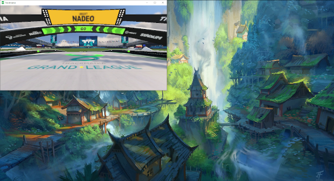

# Getting started with TMRL

Before reading these instructions, make sure you have installed TMRL and OpenPlanet correctly as described [here](Install.md).

**Configuration:** Tune TrackMania experiments in **`~/TmrlData/config/local.yaml`** (YAML merges on top of package defaults). Use `python -m tmrl --print-config` to verify the merged config. Details: [reference_guide.md](reference_guide.md).

## Pre-trained AI in Trackmania 2020

You can test our pre-trained AIs directly in TrackMania by following these steps (we recommend doing this once, so you understand how `tmrl` controls the video game):

### Load the tmrl-test track into your TrackMania game:
- Navigate to your home folder (`HOME_REDACTED\`), and open `TmrlData\resources`
- Copy the `tmrl-test.Map.Gbx` file into `...\Documents\Trackmania\Maps\My Maps` (or equivalent on your system).

### Test pre-trained AIs:

#### Game preparation

- Launch TrackMania 2020
- In case the OpenPlanet menu is showing in the top part of the screen, hide it using the `f3` key
- Launch the `tmrl-test` track. This can be done by selecting `create > map editor > edit a map > tmrl-test > select map` and hitting the green flag.
- Set the game in windowed mode. To do this, bring the cursor to the top of the screen and a drop-down menu will show. Hit the windowed icon.
- Bring the TrackMania window to the top-left corner of the screen. On Windows10, it should automatically fit to a quarter of the screen _(NB: the window will automatically snap to the top-left corner and get sized properly when you start the AI)_.
- Hide the ghost by pressing the `g` key.

#### If you want to test the pre-trained AI for raw screenshots

The bundled CNN policies expect the **Vanilla CNN** model preset (not the default residual MLP used for lidar).

1. Set a Hydra model override (shell **or** IDE run configuration), e.g. on Linux/macOS:

   ```bash
   export TMRL_HYDRA_OVERRIDES='["model=vanilla_cnn_actor_critic"]'
   ```

   On Windows (PowerShell):

   ```powershell
   $env:TMRL_HYDRA_OVERRIDES = '["model=vanilla_cnn_actor_critic"]'
   ```

2. Merge something like the following into **`~/TmrlData/config/local.yaml`** (snippets are illustrative; confirm with `--print-config`):

```yaml
schema_version: "0.6.0"

run:
  name: SAC_4_imgs_pretrained

environment:
  rtgym_interface: TM20FULL
  use_images: true
  window_width: 256
  window_height: 128
  img_width: 64
  img_height: 64
  img_grayscale: true
  sleep_time_at_reset: 1.5
  img_hist_len: 4
  rtgym:
    time_step_duration: 0.05
    start_obs_capture: 0.04
    time_step_timeout_factor: 1.0
    act_buf_len: 2
    benchmark: false
    wait_on_done: true
  reward:
    constant_penalty: 0.0
    check_forward: 500
    check_backward: 10
    end_of_track_reward: 100.0
```

- Use the default camera by hitting the `1` key (the car must be visible).
- For best performance, use the `Canadian flag` skin, because this is what we trained with.

The trackmania window should now look like this
_(note: it will be downscaled when starting the worker)_:


#### If you want to test the pre-trained AI for LIDARs

Merge something like this into **`~/TmrlData/config/local.yaml`** (defaults are already lidar-oriented; this aligns run name / window sizing with older guides):

```yaml
schema_version: "0.6.0"

run:
  name: SAC_4_LIDAR_pretrained

environment:
  rtgym_interface: TM20LIDAR
  window_width: 958
  window_height: 488
  use_images: false
  sleep_time_at_reset: 1.5
  img_hist_len: 4
  rtgym:
    time_step_duration: 0.05
    start_obs_capture: 0.04
    time_step_timeout_factor: 1.0
    act_buf_len: 2
    benchmark: false
    wait_on_done: true
  reward:
    constant_penalty: 0.0
    check_forward: 500
    check_backward: 10
    end_of_track_reward: 100.0
```

- Enter the cockpit view by hitting the `3` key (the car must be hidden, press several times if the cockpit is visible).

The trackmania window should now look like this:



#### Then:
- Open a terminal and put it where it does not overlap with the trackmania window.
For instance in the bottom-left corner of the screen.
- Run the following command, and directly click somewhere in the TrackMania window so that `tmrl` can control the car.
```shell
python -m tmrl --test
```

You should now see the car drive autonomously.

### Troubleshooting:
#### Errors:
If you get an error saying that communication was refused, try reloading the `TMRL grab data` script in the OpenPlanet menu.

In case you get a DLL error from the `win32gui/win32ui/win32con` library, install `pywin32` without using `pip` (e.g., use `conda install pywin32`).

#### Profiling / optimization:
If you see many warnings complaining about time-steps timing out, this means your computer struggles at running the AI and trackmania in parallel.
Try reducing the trackmania graphics to the minimum (in particular, try setting the maximum fps to 30, but not much less than this, because screenshots are captured at 20 fps).

In the `Graphics` tab of the TM20 settings, make sure that the resolution is 958 * 488 pixels for the LIDAR environment and 256 * 128 pixels for the raw screenshot environment.

The `Input` setting for gamepads must be the default.

More insight regarding your bottlenecks can be gained using the `--benchmark` option.
Set **`environment.rtgym.benchmark: true`** in `local.yaml` (or pass a JSON merge via `TMRL_CONFIG_OVERRIDES`), then run:
```bash
python -m tmrl --benchmark
```
This will run an episode and print results such as:
```terminal
Benchmark results:
{'time_step_duration': (0.04973503448440074, 0.0026528655942530876),
'step_duration': (0.04807219094465544, 0.002513953782792142),
'join_duration': (0.04780806270254146, 0.002499383592620444),
'inference_duration': (0.001633495957288204, 0.0004890919531246595),
'send_control_duration': (0.0006831559519106576, 0.0004686670785507652),
'retrieve_obs_duration': (0.024897294799567357, 0.0023167497316040745)}
```
where each tuple is a duration in seconds representing `(mean, mean deviation)`.

For instance, here, we can see that time-steps are of 0.05s (20 FPS), with a very fast inference (policy), and observation retrieval (screenshot + lidar computation) being a potential bottleneck with a non-negligible mean of 0.025s.
Note that inference and observation retrieval happen in parallel:
in the very worst case, both could be almost 0.05s.
Therefore, we have some margin here, in particular regarding the policy.

## Train your own self-driving AI

`tmrl` enables training your own policies, on your own tracks:

### Build a reward function:

_(Instructions for TrackMania 2020)_

- Build or select a track.
  - It can be any track when using the **vision / full** pipeline (screenshots from the game).
  - Plain-road tracks suit **boundary lidar** setups best (reward uses pre-recorded left/right boundaries, not legacy screen rays).
- Record a reward for this track:
  - Execute:
  ```shell
  python -m tmrl --record-reward
  ```
  - Wait for the recording to start (a message will be displayed in the terminal)
  - Complete the track
- Check that your reward and environment work correctly:
  - Execute:
  ```shell
  python -m tmrl --check-env
  ```
  - Control the car manually. You should see the screenshots/LIDAR and rewards.
  - Press `CTRL + C` to exit.

### Train:

- Open 3 terminals and put them where they do not overlap with the trackmania window.
For instance in 3 other corners of the screen.
- Run the following commands in the 3 different terminals (one per terminal), then, quickly click somewhere in the TrackMania window so that `tmrl` can control the car.
```shell
python -m tmrl --server
```
```shell
python -m tmrl --trainer
```
```shell
python -m tmrl --worker
```

_(Note: you may want to run these commands on separate computers instead, for instance if the trainer is located on a remote HPC computer. Adapt **`distributed.*`** in `local.yaml` for this; see [reference_guide.md](reference_guide.md).)_

During training, make sure you don't see too many 'timestep timeouts' in the worker terminal.
If you do, your GPU may be saturated or the trainer starves the worker—consider remote training (server/worker locally, trainer on a dedicated machine).

Don't forget to tune hyperparameters under **`training`**, **`algorithm`**, **`model`**, and **`environment`** in `local.yaml`.

With carefully chosen hyperparameters, an RTX3080 on a distant machine as trainer and one local machine as worker/server, it takes approximatively 5 hours for the car to understand how to take a turn correctly in the LIDAR environment.
And it takes more like 2 days in the raw screenshots environment! :wink:

_(Note: you can exit these processes by pressing `CTRL + C` in each terminal)_

### Log training metrics:

Training metrics are logged to [Weights and Biases](https://wandb.ai) **by default** on the trainer. To **disable** logging:

```shell
python -m tmrl --trainer --no-wandb
```

Set **`wandb.*`** in `local.yaml` or export **`WANDB_API_KEY`** to use your own project instead of defaults.

Please replace defaults with your own credentials if you want to hide/keep your training data, or if you want to log large files.
We clean the public project once in a while.

### Save replays:

Set **`environment.rtgym.interface_kwargs.save_replays: true`** in `local.yaml` to request replay capture when the interface supports it.

All runs will be recorded, including the failed ones.

_Note: If you use `python -m tmrl --test` to record, you may also want `environment.sleep_time_at_reset: 0.0` for a clean start (but you should leave this to `1.5` when using `python -m tmrl --trainer`)._

## Use the TMRL API for other robot applications

If you are a python developer and wish to use the `tmrl` library with your own robots, well, we have your back.
In fact, we have written a very long tutorial just for you :kissing_heart:

Time to get your hands dirty with some serious [python coding](tuto_library.md).
