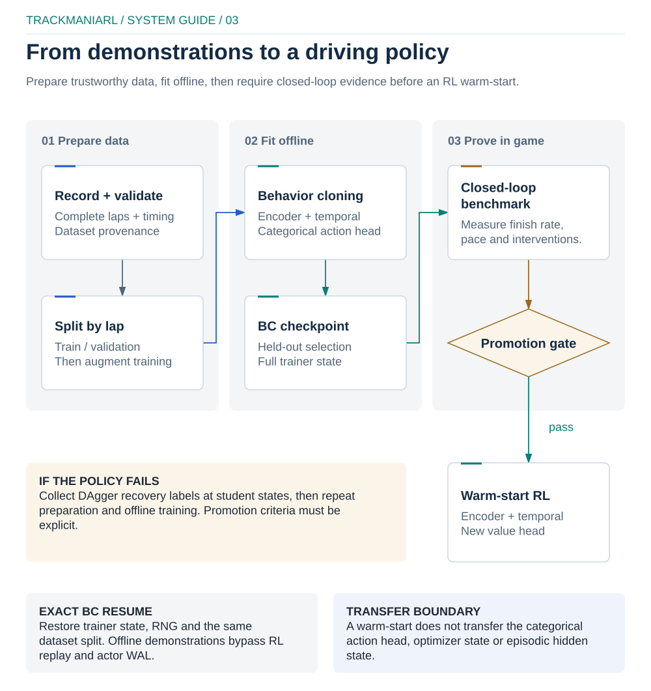

# Imitation learning

`trackmaniarl.trackmania.imitation_learning` is the public package for offline
imitation workflows. Behavior cloning (BC) is its supervised training method.
It shares the lidar
encoder and temporal components with value-based models, but it does not write
rollouts to WAL or replay. Use BC to initialize a policy, verify it in closed
loop, then transfer compatible encoder and temporal weights into an RL run.

<p align="center">
  
</p>

[Editable diagram](../docs/diagrams/imitation-learning.excalidraw) ·
[local preview](../docs/diagrams/imitation-learning-preview.html)

## Data contract

Record at least three complete laps on one map. Each demonstration records its
map UID, geometry hash, action timing, telemetry frames, controls and finish
time. `bc-train` rejects:

- a different map, geometry, action set or decision interval;
- recordings that start late, have sparse telemetry or use non-frame-start
  control alignment;
- demonstrations containing actions outside `compact_action_ids`;
- fewer than three complete human laps.

The split is deterministic by seed and occurs at lap level. The fastest lap is
kept in training and train/validation identities are always disjoint. Recovery
archives are split by episode when at least three episodes exist. One or two
recovery episodes are train-only, so they cannot make human-lap validation
optimistic.

Archives are NumPy files loaded with `allow_pickle=False`. Treat datasets from
other people as untrusted input and retain the driver's consent, provenance and
license outside the model checkpoint. Every BC run writes
`bc-dataset-manifest.json` with file hashes, sizes, action IDs, feature/model
configuration, split membership and a dataset fingerprint.

## Configuration

The RunSpec must use API 2.0, a feature pipeline without control inputs, a
categorical model factory and the BC learner. Starting from the generated
Trackmania configuration, make these entries agree (the replay, sampler,
evaluator and geometry settings can remain in place):

```yaml
api_version: "2.0"

components:
  learner:
    class_path: trackmaniarl.trackmania.imitation_learning:BehaviorCloningLearner
    kwargs:
      learning_rate: 3.0e-4
      validation_interval: 100
      early_stopping_patience: 30
      execution: {device: auto, precision: bfloat16}

  environment:
    class_path: trackmaniarl.trackmania.environment:OpenPlanetEnvironmentFactory
    kwargs:
      config:
        geometry_path: assets/trackmaniarl-test.geometry.npz
        expected_map_uid: <map-uid>
        compact_action_ids: [0, 1, 3, 39, 72, 73, 75]

  model_factory:
    class_path: trackmaniarl.trackmania.imitation_learning:LidarBehaviorCloningModelFactory
    kwargs:
      action_ids: [0, 1, 3, 39, 72, 73, 75]
      telemetry_dim: 17
      spatial_bins: 12
      history_length: 8
      previous_action_conditioning: false

  feature_pipeline:
    class_path: trackmaniarl.trackmania.features:LidarFeaturePipeline
    kwargs:
      geometry_path: assets/trackmaniarl-test.geometry.npz
      expected_map_uid: <map-uid>
      history_length: 8
      include_control_inputs: false

training:
  batch_size: 256
  metrics_interval_updates: 50
```

`action_ids` must exactly match
`components.environment.kwargs.config.compact_action_ids`, and the model's
`history_length`, `telemetry_dim` and `lidar_channels` must match the feature
pipeline output. The minimal configuration above produces 17 telemetry values
and four lidar channels. If
`previous_action_conditioning` is enabled, human and recovery data use expert
previous actions during training; inference uses the policy's previous
prediction. DAgger collection deliberately requires conditioning to be off.

Horizontal reflection is opt-in and only accepts the versioned local
8-channel lidar/46-feature telemetry schema. That schema requires local
velocity, track-relative, pace, racing-line, finish, dynamics and goal features
with control inputs excluded; set the model to `lidar_channels: 8`,
`telemetry_dim: 46` and `telemetry_group_dims: [23, 5, 4, 14]`. It mirrors
steering labels and known directional fields, preserves other tensor fields,
and fails explicitly for an incompatible schema.

## Commands

```bash
uv run trackmaniarl track record-demo demonstrations --config run.yaml --count 3
uv run trackmaniarl validate run.yaml
uv run trackmaniarl bc-train run.yaml --demo demonstrations
# Requires the 8-channel/46-feature schema described above.
uv run trackmaniarl bc-train run.yaml --demo demonstrations \
  --recovery recovery.npz --horizontal-flip-augmentation
uv run trackmaniarl bc-train run.yaml --demo demonstrations \
  --recovery recovery.npz --resume artifacts/<run-id>/checkpoints/bc-latest.pt
uv run trackmaniarl bc-benchmark run.yaml \
  artifacts/<run-id>/checkpoints/bc-best-validation.pt --trials 30
```

Training uses contiguous feature tensors, deterministic batch sampling,
class/sample/transition weighting, optional focal and steering losses, AMP when
requested, gradient clipping, ReduceLROnPlateau and early stopping. Validation
loss uses the global effective weight denominator, so changing validation
batch size does not change the result.

## Artifacts and metrics

- `manifest.json`: immutable redacted RunSpec and execution environment;
- `bc-dataset-manifest.json`: data and preprocessing attribution;
- `events.jsonl`: interval training and validation metrics;
- `checkpoints/bc-latest.pt`: exact-resume state, including RNG and trainer
  selection state;
- `checkpoints/bc-best-validation.pt`: best open-loop policy candidate.

Accuracy is exact compact-action accuracy. Balanced accuracy averages recall
over observed actions. Transition metrics cover action changes, steering
metrics collapse actions to left/neutral/right, and intervention metrics cover
teacher interventions. The control score ranks eligible open-loop candidates;
it is not evidence that the car drives safely or finishes.

Always run `bc-benchmark` before promotion. Compare finish rate first, then
median finish time/progress and intervention/recovery behavior, and use
open-loop metrics only as tie-breakers. A checkpoint that improves frame-level
accuracy may regress in closed loop because prediction errors compound.

## RL handoff and limitations

Warm-start only named compatible submodules. Encoder and temporal weights can
move into IQN/FQF or another composed model; a categorical BC head is not a
quantile head. Warm-start reports must show matched tensors, while RL resume
still requires an exact 2.0 architecture fingerprint.

BC remains sensitive to expert quality, class imbalance and covariate shift.
It does not optimize lap return or recovery trajectories directly. Use DAgger
or demonstration-aware RL objectives for states outside the expert
distribution, and never promote a model solely from open-loop validation.
