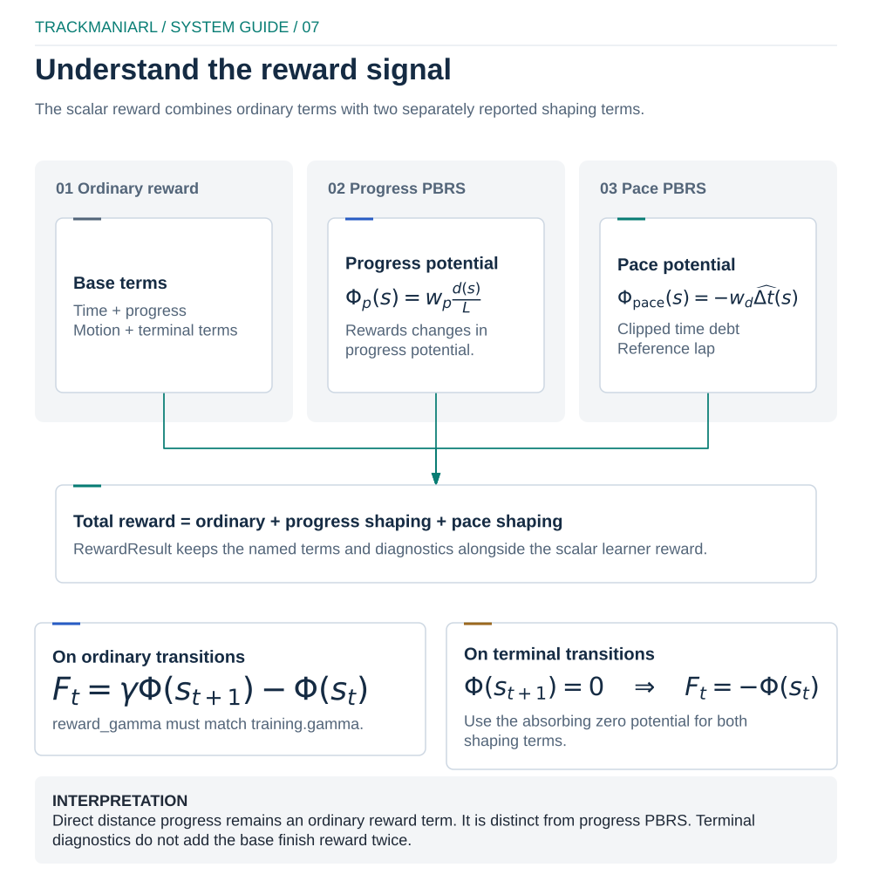

# Trackmania reward

`TrajectoryReward` is the built-in geometry-based time-trial objective used by
`OpenPlanetEnvironmentFactory`. It combines an explicit task reward with two
potential-based shaping terms. The configured geometry, telemetry units and
learner discount are part of the reward contract; changing one without the
others changes the objective.

See [configuration](configuration.md) for the complete RunSpec hierarchy and
[algorithms](algorithms.md) for learner-specific constraints.

<p align="center">
  
</p>

[Editable diagram](../docs/diagrams/reward-decomposition.excalidraw) ·
[local preview](../docs/diagrams/reward-decomposition-preview.html)

## Reward equation

For one environment transition, the reported scalar is exactly

```text
r = r_time + r_progress-PBRS + r_direct-progress
  + r_projected-velocity + r_projected-speed + r_steering-delta
  + r_terminal + r_time-attack + r_collision + r_pace-PBRS
```

Every term is also exposed in the transition `info` mapping. A disabled term is
zero. The terminal task reward and terminal time-attack adjustment are separate
diagnostics; neither is counted twice.

The two PBRS terms follow

```text
F(s, a, s') = gamma * Phi(s') - Phi(s)
```

from [Policy invariance under reward transformations: Theory and application
to reward shaping](https://ai.stanford.edu/~ang/papers/shaping-icml99.pdf).
On every terminal reason, TrackmaniaRL sets the next potential to zero, so the
terminal shaping contribution is `-Phi(s)`. Reset establishes the initial
potential for the next episode. `components.environment.kwargs.config.reward_gamma`
must therefore equal `training.gamma`; RunSpec resolution rejects a mismatch
for the built-in environment.

## Components

Let `dt` be the elapsed race-clock time in seconds, capped by
`max_time_delta_s`; `L` the total centre-line length in metres; `d` the accepted
monotonic progress; `v_parallel` the velocity projected on the local unit
tangent; and `p = d / L`.

| Component | Formula and units | Activation, sign and bound |
| --- | --- | --- |
| Time | `r_time = -time_penalty_per_second * dt` | Every transition with two valid timestamps. Non-positive; bounded per step by `-scale * max_time_delta_s`. |
| Direct progress | `r_direct-progress = progress_reward_full_lap * Delta(d) / L` | When accepted progress increases. Non-negative and sums to at most the configured full-lap scale before terminal completion adjustment. This is a task reward, not PBRS. |
| Progress PBRS | `Phi_progress = potential_progress_weight * p`; `F = gamma * Phi' - Phi` | Every non-terminal transition; terminal next potential is zero. Potential lies in `[0, potential_progress_weight]`. With `gamma < 1`, waiting at a fixed potential is slightly negative. |
| Projected velocity | `r_projected-velocity = projected_velocity_scale * v_parallel * dt` | Time-scaled. Signed; `v_parallel` is clipped to `[-max_projected_speed_mps, +max_projected_speed_mps]`. Missing velocity yields zero. |
| Positive projected speed | `r_projected-speed = projected_speed_bonus_scale * max(0, v_parallel / max_projected_speed_mps)^2 * dt` | Time-scaled, non-negative and bounded by `scale * dt`. Reversing receives no bonus. |
| Steering delta | `r_steering-delta = -steering_delta_penalty * abs(steer_t - steer_(t-1))` | Applied when steering is supplied. Steering is clipped to `[-1, 1]`, so the term lies in `[-2 * scale, 0]`. It is per decision, not time-normalized. |
| Finish/failure | `+finish_reward` on a valid finish; `-terminal_failure_penalty` on failure | Once, on termination. Failures are `off_track`, `time_limit`, `no_progress` and `slow_progress`. |
| Time attack | `bonus_scale * max(0, target_s - finish_s)^2 + linear_scale * (target_s - finish_s)` | Valid finish only. Lower-bounded by `-finish_reward`; it can reward beating the target and penalize missing it. Both scales require `time_attack_target_s`. |
| Collision | `-collision_penalty` | On a detected collision outside the race-clock cooldown. Non-positive. A collision inside the cooldown is still reported but is not penalized again. |
| Pace PBRS | `Phi_pace = -pace_reward_scale * clipped_time_debt`; `F = gamma * Phi' - Phi` | Requires a reference demonstration and race time. Terminal next potential is zero. The debt is clipped to `[-pace_debt_clip_s, +pace_debt_clip_s]`. |

Direct progress and progress PBRS are intentionally independent. Direct
progress changes the task objective; PBRS redistributes feedback while
preserving the discounted optimal-policy ordering under its assumptions. Set
`progress_reward_full_lap: 0.0` when an experiment needs shaping without the
extra task reward. Do not infer safe weights solely from their names: log the
component returns and compare their episode totals with `finish_reward`.

All fields below are stable built-in environment fields under
`components.environment.kwargs.config`; every numeric value must be finite.

| Field | Type/default; range | Exact effect and tuning risk |
| --- | --- | --- |
| `crash_distance` | float `25.0` m; `>0` | Maximum local trajectory distance before `off_track`. Too small rejects valid corner cuts; too large admits another nearby branch. |
| `no_progress_steps` | int `200`; `>=1` | Terminal after this many decisions without a higher accepted index. It is cadence-dependent. |
| `slow_progress_window_steps` | int `80`; `>=2` | Length of the rolling metric-progress terminal window. |
| `minimum_progress_per_window_m` | float `2.0` m; `>=0` | Minimum progress required in that window. Zero disables slow-progress failure in practice. |
| `terminal_failure_penalty` | float `1.0`; `>=0` | Magnitude subtracted once on any natural failure terminal. |
| `collision_penalty` | float `0.05`; `>=0` | Magnitude subtracted for an eligible collision signal. |
| `collision_cooldown_s` | float `0.0` s; `>=0` | Minimum race-clock spacing between penalties. Large values hide repeated impacts, although detection is still counted. |
| `minimum_finish_steps` | int `50`; `>=1` | Earliest decision at which finish UI can terminate successfully. |
| `nearest_forward_points` | int `500`; `>=1` | Local forward projection window in geometry points. Too small loses fast movement; too large makes folded tracks more ambiguous. |
| `nearest_backward_points` | int `10`; `>=0` | Backward search allowance for localization only; accepted progress remains monotonic. |
| `time_penalty_per_second` | float `0.1`; `>=0` | Negative reward per accepted race-clock second. |
| `max_time_delta_s` | float `1.0` s; `>0` | Per-step clock cap for time-scaled reward and the no-clock movement allowance. Too small undercounts real stalls; too large makes telemetry gaps dominate. |
| `maximum_race_time_s` | float/null `null`; `>0` | Optional `time_limit` failure terminal in physical seconds. |
| `progress_reward_full_lap` | float `10.0`; `>=0` | Total direct reward for one accepted metric lap. |
| `finish_reward` | float `30.0`; `>=0` | Base valid-finish terminal reward and magnitude floor for a negative time-attack adjustment. |
| `potential_progress_weight` | float `2.0`; `>=0` | Maximum progress potential. Zero disables progress PBRS. |
| `max_projected_speed_mps` | float `100.0` m/s; `>0` | Symmetric projected-velocity clip, positive-speed normalization and movement-speed cap. It must exceed plausible speed without legitimizing teleports. |
| `velocity_to_mps_scale` | float `0.001`; `>0` | Multiplier from native OpenPlanet velocity units to m/s. A unit error rescales velocity rewards by the same factor. |
| `projected_velocity_scale` | float `0.0`; `>=0` | Linear signed velocity reward per metre travelled along the local tangent. |
| `projected_speed_bonus_scale` | float `0.0`; `>=0` | Quadratic positive velocity-ratio bonus per second. |
| `steering_delta_penalty` | float `0.0`; `>=0` | Per-decision action smoothness cost; not time-normalized. |
| `time_attack_target_s` | float/null `null`; `>0` | Finish-time reference required by either time-attack scale. |
| `time_attack_bonus_scale` | float `0.0`; `>=0` | Quadratic reward for seconds faster than target; no quadratic penalty when slower. |
| `time_attack_linear_scale` | float `0.0`; `>=0` | Signed linear seconds-ahead term at finish. |
| `pace_reference_path` | path/null `null` | One explicit compatible demonstration. Requires `geometry_path`. |
| `pace_reward_scale` | float `0.0`; `>=0` | Potential magnitude per second of clipped time debt. Non-zero requires `pace_reference_path`. |
| `pace_debt_clip_s` | float `10.0` s; `>0` | Symmetric debt clip before pace potential construction. |
| `reward_gamma` | float `0.995`; `[0,1]` | Discount inside both PBRS terms; must equal `training.gamma`. |
| `use_racing_line` | bool `false` | Uses the geometry asset racing line instead of its reward centre for progress, tangent and pace projection. |

## Geometry and movement validation

The trajectory must contain at least two finite 3D points. Adjacent duplicates
and opposing neighbouring segments that produce a zero local tangent are
rejected when the geometry or reward is constructed.

Nearest-point search is local: it includes a bounded number of points behind
and ahead of the current monotonic index. Progress never decreases. A candidate
advance is also capped by physical displacement and elapsed time:

```text
accepted_motion <= min(position_displacement,
                       max_projected_speed_mps * time_budget)
```

This prevents a stationary car near a later crossing or hairpin from catching
up over repeated calls, and avoids using a global longest-segment allowance on
shorter parts of the map. If race time is absent, the conservative time budget
is `max_time_delta_s`.

`velocity_to_mps_scale` converts the OpenPlanet velocity field to metres per
second before the tangent dot product. The built-in environment uses `0.001`.
Changing the telemetry source requires a measured unit conversion, not a reward
weight adjustment. Uneven geometry sampling affects index density but progress
percentage and direct progress use cumulative metric distance.

The valid-finish gate requires all of the following:

- the game finish UI is active;
- metric progress has reached `finish_progress`;
- at least `minimum_finish_steps` decisions have elapsed;
- the car is within `crash_distance` of the local trajectory.

These checks reject a finish signal at the start and most cross-track or
teleport shortcuts. Geometry still needs to follow the intended driving line
in order and at sufficient density.

## Time, cadence and termination

Race timestamps must be finite, non-negative and monotonic within an episode.
Identical timestamps produce `dt = 0`; a backward timestamp raises an error.
A large forward gap is capped by `max_time_delta_s` for all time-scaled terms
and for the reachable-progress allowance. Reset clears collision cooldown,
steering history, progress windows and both previous potentials.

Time, projected-velocity and projected-speed terms are approximately invariant
to a reasonable decision-cadence change because they integrate over `dt`.
Metric direct progress and telescoping PBRS are cadence-independent for the
same accepted path. Steering delta and step-count termination windows are not:
when changing `action_repeat_frames` or `decision_interval_ms`, convert the
desired real-time stall windows into new `no_progress_steps` and
`slow_progress_window_steps` values and re-evaluate the steering penalty.

Game or telemetry interruption is an environment truncation, not a natural MDP
terminal. Natural reward reasons set `terminated=True`. Replay bootstrapping
stops at a true terminal, while a truncation preserves the learner's configured
bootstrap semantics. N-step sampling never crosses either episode boundary.

## Human pace reference

`pace_reference_path` selects one concrete demonstration archive. TrackmaniaRL
does not search a directory or automatically choose the fastest lap. Record
and retain compatible complete laps, compare their `finish_time_s`, then point
the RunSpec at the fastest retained archive you deliberately selected.

The loader verifies:

- `map_uid` equals the geometry asset map UID;
- `geometry_sha256` equals the geometry asset hash;
- all frames and timestamps are finite;
- race times are strictly increasing;
- exactly the final frame has the finish flag;
- `finish_time_s` agrees with the final frame within 50 ms;
- the monotonic projection reaches the end of the trajectory.

Demonstration positions are projected monotonically onto the geometry. The
first time observed at each visited trajectory index is retained, missing
indices are linearly interpolated, and the last profile value is set to the
recorded finish time. Optional speed values are converted with
`velocity_to_mps_scale`, interpolated and smoothed; the reward itself uses the
reference times.

At a non-terminal step,

```text
reference_time = profile[current_geometry_index]
time_debt = clip(race_time - reference_time,
                 -pace_debt_clip_s, +pace_debt_clip_s)
Phi_pace = -pace_reward_scale * time_debt
```

At a valid finish, the reference is the final profile time. On every terminal
reason, the next pace potential is zero. A negative debt means the agent is
ahead; a positive debt means it is behind.

## Configuration fragment

This is a fragment for
`components.environment.kwargs.config`, not a complete RunSpec:

```yaml
geometry_path: assets/my-map.geometry.npz
expected_map_uid: my-map-uid

reward_gamma: 0.995       # must equal training.gamma
time_penalty_per_second: 0.1
max_time_delta_s: 1.0
progress_reward_full_lap: 10.0
potential_progress_weight: 2.0
finish_reward: 30.0
terminal_failure_penalty: 1.0

max_projected_speed_mps: 100.0
velocity_to_mps_scale: 0.001
projected_velocity_scale: 0.0
projected_speed_bonus_scale: 0.0
steering_delta_penalty: 0.0

time_attack_target_s: 40.0
time_attack_bonus_scale: 0.1
time_attack_linear_scale: 0.2

collision_penalty: 0.05
collision_cooldown_s: 0.25

pace_reference_path: demonstrations/fastest-compatible-lap.npz
pace_reward_scale: 0.5
pace_debt_clip_s: 10.0
```

Pair it with:

```yaml
training:
  gamma: 0.995
```

Validate the complete file before touching the game:

```bash
uv run trackmaniarl validate run.yaml
uv run trackmaniarl track check --config run.yaml
uv run trackmaniarl smoke run.yaml --transitions 100
```

The last two commands are live gates and require Trackmania, the prepared map,
controller backend and [TrackmaniaRL Connect](https://openplanet.dev/plugin/sac_getdata).
