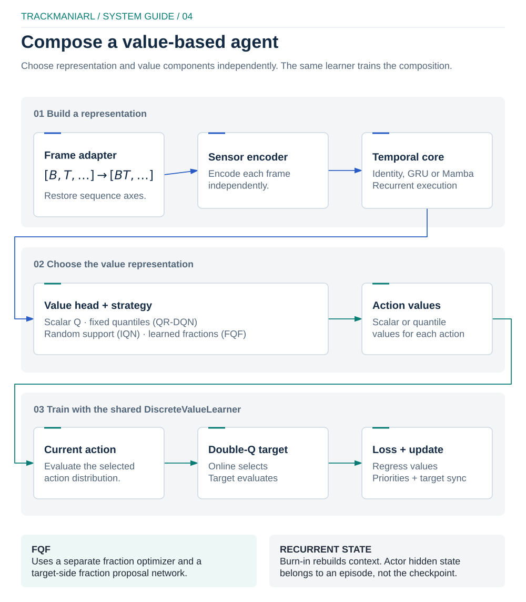

# TrackmaniaRL SDK Guide

TrackmaniaRL has one RunSpec 2.0 component runtime. An explicit `run.yaml` is
parsed into `RunSpec`, its components are imported, then the selected online RL
or offline-supervised lifecycle is executed. The same commands work in
PowerShell, bash, WSL and CI.

```bash
uv tool install "trackmaniarl==2.0.0rc1"
trackmaniarl init my-trackmania-agent --template trackmania
cd my-trackmania-agent
uv sync
uv run trackmaniarl validate run.yaml
```

For library development from a clone, follow
[development.md](development.md#repository-setup) instead. Do not mix changes to
the reusable package with one experiment: the generated project is the intended
place for custom components and run configurations.

## Start with bundled components

Learners and composable models are selected through stable descriptive class
paths:

```yaml
components:
  learner:
    class_path: trackmaniarl.algorithms.value_based:DiscreteValueLearner
  model_factory:
    class_path: trackmaniarl.models.factory:CompositeValueModelFactory
    kwargs:
      encoder: {class_path: my_agent.models:MySensorEncoder}
      temporal:
        class_path: trackmaniarl.models.temporal:IdentityTemporalCore
        kwargs: {input_dim: 256}
      head:
        class_path: trackmaniarl.models.heads:ImplicitQuantileHead
        kwargs: {feature_dim: 256, action_count: 78, cosine_count: 64, dueling: true}
      strategy:
        class_path: trackmaniarl.models.strategies:RandomQuantileStrategy
        kwargs: {train_quantile_count: 32, target_quantile_count: 32}
  feature_pipeline:
    class_path: trackmaniarl.builtins.features:TransitionFeaturePipeline
  replay_store:
    class_path: trackmaniarl.core.replay:InMemoryReplayStore
  sampler:
    class_path: trackmaniarl.core.replay:PrioritizedSampler
```

Each learner consumes a `TrainingBatch` with explicit n-step bootstrap discounts,
termination/truncation flags, PER weights and monotonic transition IDs. This lets
a user replace one component at a time without extra runtime adapters.

Set `training.n_step`, `training.gamma`, `training.sequence_length`, and optional
`training.beta` in `run.yaml`; the local trainer forwards these values in every
`BatchRequest`. Discounting is intentionally owned by this replay request rather
than by individual learner constructors.

`UniformSampler`, `PrioritizedSampler`, `SequenceSampler` and `DemoMixSampler`
are separate from `InMemoryReplayStore`. PER receives `PriorityUpdate` from a
learner, sequence sampling accepts only contiguous episode windows, and demo
mixing enforces explicit min/max fractions.

Bundled model factories declare a `ModelContract`, and bundled learners declare
the contracts they accept. This keeps an encoder choice independent from runtime
or controller selection while preventing invalid objective/head combinations.
For example, scalar Q, QR-DQN, IQN and FQF compositions implement
`discrete_value` and are all trained by `DiscreteValueLearner`;
TQC requires `continuous_quantile_actor_critic`, and behavior cloning requires
`categorical_policy`. Custom components without declarations retain structural
protocol validation, while declared incompatible pairs fail during resolution.

### Value-model composition

`CompositeValueModelFactory` validates dimensions and representation contracts
before training:

<p align="center">
  
</p>

[Editable diagram](../docs/diagrams/model-composition.excalidraw) ·
[local preview](../docs/diagrams/model-composition-preview.html)

| Algorithm | Head | Strategy | Optimizers |
| --- | --- | --- | --- |
| Standard Q | `ScalarQHead` | `ScalarValueStrategy` | main |
| QR-DQN | `FixedQuantileHead` | `FixedQuantileStrategy` | main |
| IQN | `ImplicitQuantileHead` | `RandomQuantileStrategy` | main |
| FQF | `ImplicitQuantileHead` | `LearnedFractionStrategy` | main + fractions |

The encoder maps independent `[N,...]` frames to `[N,D]`.
`FrameBatchAdapter` owns `[B,T]` flatten/restore, and `IdentityTemporalCore`,
`GruTemporalCore` or `MambaTemporalCore` consumes `[B,T,D]`. History, burn-in
and recurrent state do not belong in a `SensorEncoder`.

The learner creates a fraction optimizer whenever
`strategy.auxiliary_parameters()` is non-empty. FQF quantile regression does
not update fraction boundaries, and its analytical fraction objective does not
update the encoder or quantile head.

`evaluate_actions` is the selected-action hot path. Double-DQN first obtains
online expected values for action selection, then asks the target model only
for the distribution of `a*`. Objectives must explicitly request all-action
tensors.

### Mamba backend selection

```yaml
temporal:
  class_path: trackmaniarl.models.temporal:MambaTemporalCore
  kwargs:
    input_dim: 256
    backend: auto  # auto | native | torch
    d_state: 16
    d_conv: 4
    expand: 2
```

`native` fails validation when its extension/kernel is unavailable. `torch` is
portable Pure PyTorch. `auto` probes native forward/backward and records its
choice and fallback reason. Both backends share parameters and checkpoint
fingerprints; no backend silently substitutes GRU.

## Implement only what changes

An extension project may supply any of these protocols: `Learner`,
`OfflineSupervisedLearner`, `Policy`,
`ModelFactory`, `ReplayStore`, `Sampler`, `FeaturePipeline`, `Evaluator`,
`RunLogger`, `CheckpointCodec`, and an environment factory with `create(seed=)`.
Use `module:Symbol` paths in `run.yaml`; do not modify the TrackmaniaRL package for an
experiment.

The normal extension loop is:

1. generate an installable project with `trackmaniarl init`;
2. implement or subclass one component under `src/<package>/`;
3. point the matching `components` entry at its import path;
4. add a deterministic test under the generated project's `tests/`;
5. run `uv run trackmaniarl validate run.yaml`;
6. run the game connection check and bounded smoke test only when the offline
   contract passes.

For example, a custom feature pipeline implements transformation for actor-time
observations and collation for replay samples:

```python
from typing import Any

import numpy as np

from trackmaniarl.core.data import Transition


class SpeedFeaturePipeline:
    def transform_observation(self, observation: Any) -> np.ndarray:
        return np.asarray([observation["speed"]], dtype=np.float32)

    def collate(self, transitions: list[Transition]) -> dict[str, np.ndarray]:
        return {
            "observations": np.stack([item.observation for item in transitions]),
            "actions": np.asarray([item.action for item in transitions]),
            "rewards": np.asarray([item.reward for item in transitions], dtype=np.float32),
        }
```

Reference it without editing the library:

```yaml
components:
  feature_pipeline:
    class_path: my_trackmania_agent.features:SpeedFeaturePipeline
```

The exact batch structure is a contract between the pipeline/sampler and the
learner. Keep it typed and deterministic, and test one synthetic transition
round trip before a live run.

`validate` does not start TrackMania. It resolves components, writes the
redacted manifest and runs a deterministic synthetic RL or supervised update.
The `trackmaniarl train` command requires `components.environment` and runs the
asynchronous off-policy actor/learner path. It collects bounded episodes,
writes compressed reference-only artifacts, samples replay, applies updates,
checkpoints and runs an optional evaluator. On-policy PPO instead uses the
public `trackmaniarl.Trainer` API with `OnPolicySequenceSampler`; distributed
`learner` and `actor` do not support it.

`validate` is game-free, not code-free: it imports every configured component
and invokes constructors and a learner validation update. Never validate an untrusted
configuration or Python package.

## Component responsibilities

| Contract | Required behavior | State to persist |
| --- | --- | --- |
| `Policy` | deterministic or exploratory inference | model/policy tensors when replicated |
| `Learner` | setup, update, policy access and state round trip | model, optimizer, schedules and algorithm statistics |
| `OfflineSupervisedLearner` | supervised validation without replay semantics | learner, dataset and trainer state required for exact resume |
| `ModelFactory` | construct the configured train-time model | none unless the factory is stateful |
| `EnvironmentFactory` | create one isolated environment per seed | environment state is normally episode-local |
| `FeaturePipeline` | transform one observation and collate transitions | normalization statistics, if learned |
| `ReplayStore` | append and retrieve transitions by monotonic ID | stored transitions and ID watermark |
| `Sampler` | select batches and apply priority updates | RNG, priorities and annealing state |
| `Evaluator` | evaluate a policy against the configured suite | best-result/selection state if it affects training |
| `RunLogger` | receive neutral events and close resources | remote run identity if resume needs it |
| `CheckpointCodec` | atomically save and safely load learner state | format/version metadata |

If resume behavior would change after recreating a component, its relevant state
belongs in the checkpoint. Do not hide configuration in module globals or read
environment variables inside hot-path objects.

## Checkpoint and warm-start rules

Resume and warm-start are different operations. For the asynchronous
off-policy runtime:

- resume requires schema 2.0, the exact architecture fingerprint, all online
  and target components, optimizers, objectives, counters, schedules and RNG;
- warm-start loads only named submodules and always produces a match report;
- only exact name, shape and dtype matches are copied;
- zero matches and missing required tensors are errors;
- prefix remapping and partial-shape copying are unsupported;
- pre-2.0 checkpoints are rejected; warm-start accepts current compressed
  checkpoints only.

The local on-policy `Trainer` used by PPO persists a separate schema 1.0 state
containing its learner, replay store, sampler and counters. Do not pass that
checkpoint to distributed `resume` or `learner --checkpoint`.

Stable RL component names are `encoder`, `temporal`, `head` and `strategy`
under `online` and `target`. Mamba's resolved kernel backend is runtime metadata
and may change without changing its parameter fingerprint.

Behavior cloning has a separate exact-resume artifact, `bc-latest.pt`, bound to
`bc-dataset-manifest.json`. Its best open-loop policy checkpoint is not a full
trainer resume. See [imitation learning](imitation-learning.md).

## RunSpec layout

The root fields are intentionally small:

- `api_version`: serialized contract version, currently `2.0`;
- `run_id`, `seed`, `artifacts_dir`: identity and local output ownership;
- `components`: import paths and constructor keyword arguments;
- `training`: batch, replay, update, evaluation and checkpoint schedule;
- `distributed`: chunking, timeouts, message limits, exploration profiles and
  the name of the token environment variable;
- `evaluation`: immutable map/geometry suite and acceptance thresholds;
- `metadata`: descriptive, serializable experiment metadata only.

Unknown fields fail validation. Start a new run directory when immutable
configuration, component source or contracts change; resume only a compatible
run.

## Adding code to the library itself

Promote a component from an extension project only when it is reusable across
runs. Put generic mechanisms in `core`, algorithms in `algorithms`, network
modules in `models`, and Trackmania-only behavior in `trackmania`. Expose a
stable built-in entry point only after deterministic contract, checkpoint and
resume coverage. Distributed changes additionally need idempotency, size-limit
and slow-learner tests.

See [architecture.md](architecture.md) for dependency direction and
[development.md](development.md#adding-a-public-component) for the acceptance
checklist.

## Namespaces

| Namespace | Responsibility |
| --- | --- |
| `trackmaniarl.core` | contracts, run spec, trainer, data and replay |
| `trackmaniarl.algorithms` | learners, targets, losses and objectives |
| `trackmaniarl.models` | encoders, temporal cores, heads, strategies and factories |
| `trackmaniarl.distributed` | authenticated actor/learner transport, WAL and spool |
| `trackmaniarl.trackmania` | TrackMania environment collection adapter |
| `trackmaniarl.observability` | manifest, JSONL events, artifacts and optional adapters |
| `trackmaniarl.experiments` | evaluation suites and study strategies |
| `trackmaniarl.project` | generated local extension project |

Older module locations are internal migration details, not documented runtime
API or compatibility targets.
