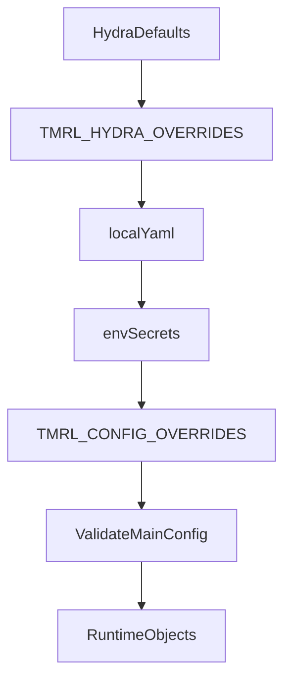

# tmrl/config — Configuration system

All configuration lives under `tmrl/config/`:

```
tmrl/config/
├── defaults/          # Hydra YAML (package defaults + override groups)
│   ├── config.yaml    # Root: schema_version, run, wandb, compute, player_runs
│   ├── algorithm/     # Algorithm presets (SAC, IQN, ...)
│   ├── model/         # Model presets (override with model=<preset>)
│   ├── distributed/   # Ports, TLS, passwords
│   ├── environment/   # TM2020 env settings, reward, rt-gym
│   ├── training/      # Epochs, batch size, scheduler, checkpoints
│   └── debugger/      # Profiling and debug flags
├── schema/            # Pydantic models validating all config sections
├── loader.py          # Hydra compose -> overrides merge -> Pydantic validation
├── constants.py       # Flat derived runtime constants from MAIN_CONFIG
├── paths.py           # Filesystem paths (checkpoints, dataset, reward, ...)
├── config_objects.py  # Runtime objects (interface, memory, agent, trainer)
├── enums.py           # AlgorithmName StrEnum
├── spacing_lookahead.py
├── run_artifacts.py   # Reproducibility bundle written at checkpoint time
└── __init__.py        # Public API re-exporting constants, paths, schema types
```

## Design goals

The config system is designed around three principles:

1. **Declarative defaults** in versioned YAML (`defaults/*`) so experiments are reproducible.
2. **Typed validation** (`schema/*`) so invalid combinations fail early with readable errors.
3. **Runtime binding layers** (`constants.py`, `config_objects.py`) so legacy code and
   runtime object construction stay simple.

## Config architecture (what each layer does)

| Layer | File(s) | Responsibility | Output |
|------|--------|----------------|--------|
| Composition | `defaults/config.yaml` + groups | Select baseline sections (`algorithm`, `model`, `environment`, ...) | raw Hydra dict |
| Merge | `loader.py` | Apply override precedence (`TMRL_HYDRA_OVERRIDES`, `local.yaml`, env secrets, `TMRL_CONFIG_OVERRIDES`) | merged dict |
| Validation | `schema/*.py`, `MainConfig` | Validate shape/ranges/cross-field constraints | `MAIN_CONFIG` |
| Derived constants | `constants.py` | Compute convenience flags and derived values (`USE_*`, `POINTS_NUMBER`, etc.) | flat module constants |
| Runtime selection | `config_objects.py` | Choose interface, memory, policy/model, agent, trainer partials | runtime object partials |

## Environment setup (`uv`)

Use `uv` consistently so missing imports do not appear only in CI:

```bash
uv sync --dev
uv run pytest -q tests/test_model_presets.py
```

When introducing a new import:

```bash
uv add <package>
uv add --dev <package>
```

## Config precedence (source of truth)

1. Hydra defaults from `tmrl/config/defaults/config.yaml` and selected groups.
2. `TMRL_HYDRA_OVERRIDES` (compose-time group overrides, e.g. `model=rnn_actor_critic`).
3. `~/TmrlData/config/local.yaml` (deep merge).
4. env secrets (`WANDB_API_KEY`/`WANDB_KEY`, `TMRL_PASSWORD`).
5. `TMRL_CONFIG_OVERRIDES` JSON object (deep merge, last-wins).
6. Pydantic validation into `MAIN_CONFIG`.



## Runtime logic design (important for experiments)

The runtime path intentionally separates **what config says** from **how objects are built**:

1. `MAIN_CONFIG` is the typed, authoritative tree.
2. `constants.py` derives runtime booleans (`USE_LIDAR`, `USE_LIDAR_IMAGES`,
   `USE_IMAGES_MOBILENET_PIPELINE`, `USE_OBS_WORLD_TELEMETRY_LAYOUT`, etc.) and
   convenience values used throughout the codebase.
3. `config_objects.py` maps those flags plus `algorithm/model` settings to concrete classes:
   - interface class,
   - memory class,
   - policy/model class,
   - training agent class,
   - trainer partial.
4. **Pydantic** (`MainConfig`) rejects some bad algorithm/model pairings early (e.g. IQN or SDSAC with a
   continuous-only vanilla CNN preset via `discrete_action_compatible` on model schemas). Further
   **interface** checks still run in `config_objects` and `effective_config.model_policy_route` and raise
   explicit `ValueError` for unsupported algorithm/interface combinations.

This avoids silent fallbacks and makes failed experiments fail fast with actionable errors.

### Naming: Hydra `model` vs `tmrl/custom/models/`

- **Hydra** uses the singular group name **`model`** (CLI / env: `model=mlp_actor_critic`). Defaults live under
  `tmrl/config/defaults/model/`.
- **Python source** for network implementations uses a plural package directory **`tmrl/custom/models/`**
  (and subfolders by input modality). That split (singular config group, plural code tree) matches common
  Hydra style.

## Quick experiment recipe

Use this for fast, reproducible ablations:

```bash
export TMRL_HYDRA_OVERRIDES='model=sophy_residual_actor_critic,algorithm=iqn'
export TMRL_CONFIG_OVERRIDES='{"run":{"name":"iqn_sophy_lr3e-5"},"algorithm":{"lr_actor":3e-5},"training":{"batch_size":512}}'
uv run python -m tmrl --print-config
uv run python -m tmrl --trainer
```

`--print-config` prints the final redacted merged config (top-level keys in `MainConfig` order, with `# --- section ---` headers) so you can verify exactly what will run.

`--explain-active-config` lists which `model.*` keys actually affect the current **algorithm + rtgym_interface** routing and which are ignored (helps avoid dead keys in `local.yaml`, e.g. IQN vs `residual_mlp_num_blocks_actor`).

### IQN + boundary lidar (discrete actions)

IQN uses **`DQNActor`** on workers and **`IQNQNetwork`** in the trainer (implementation: `tmrl/custom/models/discrete_actions/iqn_discrete_q_network.py`). With **`environment.rtgym_interface`** set to a **boundary lidar** token—typically **`TM20LIDAR`** (default in `environment/tm20.yaml`), or legacy **`TM20TRACKMAP`**, or fused **`TM20TRACKMAPIMAGES` / `TM20LIDARIMAGES`**—that discrete stack is selected automatically (do not use the continuous Gaussian MLP actor).

Optional Hydra preset for IQN-friendly reward shaping on that layout: **`environment=lidar_iqn`** (`defaults/environment/lidar_iqn.yaml`; extends `tm20`). Copy into `~/TmrlData/config/local.yaml` or export `TMRL_HYDRA_OVERRIDES` as below.

**TQCGrab / MTQC** interfaces still work with IQN (same `DQNActor`); use them when you need that observation layout, not because the algorithm is TQC.

### How to start training (typical three-process layout)

1. Install deps: `uv sync --dev`
2. (Optional) Set compose overrides, e.g.  
   `export TMRL_HYDRA_OVERRIDES='environment=lidar_iqn,algorithm=iqn,model=sophy_residual_actor_critic'`
3. Verify merged config: `uv run python -m tmrl --print-config`
4. In **three terminals** (same machine or LAN; match `distributed.*` in config):

```bash
# Terminal A — central server
uv run python -m tmrl --server

# Terminal B — trainer (GPU)
uv run python -m tmrl --trainer

# Terminal C — rollout worker(s); repeat with different env if multiple workers
uv run python -m tmrl --worker
```

Add `WANDB_API_KEY` (or set `wandb.api_key` in `local.yaml`) if you use Weights & Biases; use `uv run python -m tmrl --trainer --no-wandb` to disable logging.

Trainer runs that call `run_with_wandb` attach a nested **`tmrl_validated_main_config`** entry to the run
config (from `main_config_snapshot_redacted()`), in addition to the flat legacy scalars and
`merged_config`. API keys and distributed passwords are redacted.

## New baseline recipe

When you decide an experiment should become the new baseline:

1. Promote stable choices into `tmrl/config/defaults/*` in git.
2. Keep only machine-specific values (paths, secrets) in `~/TmrlData/config/local.yaml`.
3. Keep one-off toggles in `TMRL_CONFIG_OVERRIDES` only during exploration.

This keeps git history clean and avoids hidden local state.

## How to consume configuration

| Need | Import |
|------|--------|
| Flat scalars (LR, batch size, ...) | `import tmrl.config as cfg` then `cfg.BATCH_SIZE` |
| Typed tree (nested access, autocomplete) | `from tmrl.config import MAIN_CONFIG` |
| Runtime objects (trainer, memory, agent) | `import tmrl.config.config_objects as cfg_obj` |
| Filesystem paths | `from tmrl.config import CHECKPOINTS_FOLDER, MODEL_PATH_TRAINER, ...` |
| Flat dict for logging | `from tmrl.config import create_config` |
| Full redacted merged tree (pre-Pydantic merge) | `from tmrl.config import merged_config_snapshot_redacted` |
| Validated tree, redacted (JSON-friendly) | `from tmrl.config import main_config_snapshot_redacted` |

## Model presets

Canonical presets in `defaults/model/`:

- `vanilla_cnn_actor_critic`
- `vanilla_color_cnn_actor_critic`
- `sophy_actor_critic`
- `sophy_residual_actor_critic`
- `mlp_actor_critic`
- `residual_mlp_actor_critic`
- `redq_mlp_actor_critic`
- `rnn_actor_critic`
- `effnet_actor_critic`

### `tmrl/custom/models` layout (source files)

Hydra preset **names** stay short (`model=mlp_actor_critic`, …). Source files are grouped by **input modality**:

| Folder / file | What it implements |
|------|---------------------|
| `shared/base.py`, `shared/model_constants.py`, `shared/neural_network_blocks.py` | Shared utilities and NN blocks used across all families. |
| `vector_input/sac_mlp_actor_critic.py` | Continuous SAC / REDQ MLP actor + twin Q (tuple or Box obs). |
| `vector_input/sac_residual_mlp_actor_critic.py` | SAC / REDQ with residual MLP trunk (boundary lidar / vector tuple path). |
| `vector_input/sac_gru_actor_critic.py` | SAC with stacked GRU (`model=rnn_actor_critic`, boundary lidar + recurrent path). |
| `image_input/vanilla_cnn_sac.py`, `image_input/efficientnet.py`, `image_input/impala.py` | Image-first pipelines (vanilla CNN / EfficientNet / IMPALA-style). |
| `hybrid_input/sophy.py`, `hybrid_input/gnn_effnet_sophy.py` | Hybrid track+telemetry(+image) families (Sophy and variants). |
| `discrete_actions/iqn_discrete_q_network.py` | IQN / discrete Q (`DQNActor`, `IQNQNetwork`, cosine embedding, dueling). |

`tmrl.custom.models` keeps public re-exports (`from tmrl.custom.models import ...`) while internal module imports should use the new subfolders directly.

## Common experiment workflows

### 1) Quick ablation (no file edits)

- use `TMRL_HYDRA_OVERRIDES` for group switching (`model=...`, `algorithm=...`)
- use `TMRL_CONFIG_OVERRIDES` for scalar tweaks (`lr`, `batch_size`, etc.)
- verify with `--print-config` before long run

### 2) Stable local baseline

- keep team defaults in `defaults/*` under git
- keep machine-specific values in `~/TmrlData/config/local.yaml`
- avoid leaving one-off JSON env overrides exported between runs

### 3) Debugging config behavior

- run `uv run python -m tmrl --print-config`
- check whether expected values appear after all merges
- if startup fails, inspect explicit compatibility/validation error message first

## Migration notes (breaking)

- Config section renamed from `architecture` to `model`.
- Hydra group is `model`, selected via `model=<preset>`.
- Update any custom `local.yaml` keys from:
  - `architecture.*` -> `model.*`

## Why `constants.py` still exists

`defaults/*` stores declarative YAML; `constants.py` keeps runtime convenience:

- stable flat API used across code (`cfg.BATCH_SIZE`, `cfg.PORT`, ...),
- derived values not represented directly in YAML (`POINTS_NUMBER`, pragmas, fallbacks),
- simpler call sites while `MAIN_CONFIG` remains the typed source of truth.
